# Just Natural Expansion
### A Cookie Clicker Mod

## Table of Contents
* [Installation Directions](https://github.com/dfsw/Just-Natural-Expansion?tab=readme-ov-file#installation-directions)
* [Mod Compatibility](https://github.com/dfsw/Just-Natural-Expansion?tab=readme-ov-file#mod-compatibility)
* [New Achievements](https://github.com/dfsw/Just-Natural-Expansion?tab=readme-ov-file#new-achievements)
* [New Upgrades](https://github.com/dfsw/Just-Natural-Expansion?tab=readme-ov-file#new-upgrades)
* [Mysteries of the Cookie Age](https://github.com/dfsw/Just-Natural-Expansion?tab=readme-ov-file#Mysteries-of-the-Cookie-Age)
* [Changelog](https://github.com/dfsw/Just-Natural-Expansion?tab=readme-ov-file#changelog)

**The Just Natural Expansion Mod** enhances the Cookie Clicker endgame without disrupting core gameplay, staying true to the spirit of the vanilla experience. It introduces over **450 achievements**, **250 upgrades**, new goals, new stories, and deeply rooted hidden elements, all specifically designed for late-game progression, so early or mid-game players may not immediately notice changes. 

By default, the mod adds no upgrades and marks new achievements as shadow, allowing leaderboard and competition focused players to pursue extra challenges without affecting their current gameplay. 

Players aiming for higher scores and a more rewarding late-game can enable Cookie, Kitten, and Building upgrades, while also converting shadow achievements into regular ones to gain extra milk for their efforts. These upgrades can be disabled at any time, and shadow achievements can be re-enabled via the options menu. However, a permanent shadow achievement will be awarded to mark that you have used the mod outside of leaderboard/competition mode.

Many achievements are tracked across multiple ascensions or involve progress that the base game does not normally record, such as popping Shiny Wrinklers. While you may have already completed some of these, there is no way to determine your progress on them unless the mod was installed at the time they were achieved. Progress on items not tracked by the vanilla game or not carried across ascensions will only start being recorded once the mod is active. You can view additional tracked stats and their current values in the Stats menu.

**All new achievements are designed to be attainable, though some require significant effort, some even taking weeks of focused effort to earn. Thank you for playing! If you enjoy the mod, please spread the word!**

#### Special Thanks

Big, chocolate-covered thanks to the amazing folks in the [Cookie Clicker Discord](https://discord.com/invite/cookie), whose late-game wisdom and strategic tips helped shape this mod into the crunchy masterpiece it is today. 

Thank you to the beta testers who were willing to help me balance and test, I have now struck a balance between people saying these achivements are too hard and these achievements are too easy, which I suspect is the sweet middle ground. 

#### Why This Mod Exists

When I reached the late game of Cookie Clicker, I felt a real sense of loss. I was running out of meaningful goals. I looked for mods that could extend the experience without radically changing the core gameplay.

Most of what I found didn’t fit. Many end-game mods added flashy new buildings or mechanics that didn’t feel true to vanilla and often weren’t balanced. Others offered extremely difficult, sometimes nearly impossible, achievements. Those were closer to what I wanted, but I wasn’t looking for “impossible.” I wanted more of what made the base game fun.

So I set out to imagine what Cookie Clicker would feel like if it simply lasted longer with deeper goals to chase. Achievements are challenging but not unreasonable, designed for active players who like having long-term targets. Nothing breaks the existing formula (though I had to heavily nerf the new kittens to keep them balanced). The intent was always to extend the game, not reinvent it. Do not expect to knock out these achievements or upgrades in a few days. Many require weeks of planning and patience. The idea is to add lasting goals, not hand out free milk and CPS.

I hope this mod hits that mark and gives you years more clicking, planning, and cookie glory. If not, I’ll still enjoy it myself, since I built what I wanted to play. If you do find something broken or unreasonable, reach out on Discord (User: DFSW). I am always happy to discuss and evaluate.

## Installation Directions

Installing mods and add-ons for Cookie Clicker can feel intimidating if you’ve never done it before. To get some background, check out this [guide from the wiki](https://cookieclicker.fandom.com/wiki/Add-Ons) Below, you’ll find specific instructions to help you get everything set up.

#### Web (Preferred)

##### [CookieClickerModManager](https://github.com/klattmose/CookieClickerModManager) - Recommended
`https://cdn.jsdelivr.net/gh/dfsw/Just-Natural-Expansion@latest/JustNaturalExpansion.js`

##### [Bookmarklet](https://www.freecodecamp.org/news/what-are-bookmarklets/)
```javascript
javascript:(function(){Game.LoadMod('https://cdn.jsdelivr.net/gh/dfsw/Just-Natural-Expansion@latest/JustNaturalExpansion.js');})();
```

##### Direct Console Loading
```javascript
Game.LoadMod('https://cdn.jsdelivr.net/gh/dfsw/Just-Natural-Expansion@latest/JustNaturalExpansion.js');
```

#### Steam
Link to [Mod Loader](https://steamcommunity.com/sharedfiles/filedetails/?id=3572744159) on Steam. You can also search for Just Natural Expansion in the Cookie Clicker Steam Workshop.

#### Console (untested - but should work in theory)
```javascript
Game.LoadMod('https://cdn.jsdelivr.net/gh/dfsw/Just-Natural-Expansion@latest/JustNaturalExpansion.js');
```

#### Mobile
The mobile version of Cookie Clicker does not support mods at this time.

#### Compatibility Notes
- **CCSE Compatible**: Works with Cookie Clicker Script Extender
- **CCMM Compatible**: Works with Cookie Clicker Mod Manager
- **Load Order**: For best compatibility, load CCSE first, then this mod
- **Browser Support**: Works in all modern browsers 

#### Mod Compatibility

Just Natural Expansion uses Cookie Clicker’s documented API layer to extend the core game. As a result, Just Natural Expansion should remain functional for years to come—even if I get hit by a bus. However this API is fairly limited, so many modders rely on [CCSE](https://klattmose.github.io/CookieClicker/CCSE-POCs/). 

Unfortunately, CCSE uses code injection to make fundamental changes to the vanilla game’s source code, which breaks the built-in modding API in a handful of places. To address this, I’ve written a CCSE Bridge that allows CCSE mods and Just Natural Expansion to run together. The catch: **CCSE must be loaded before** Just Natural Expansion, so make sure JNE is last in your load order. Other modders are welcome to use my bridge code (located in the same repo) if they prefer a more vanilla mod approach. 

I’ve tested compatibility with many popular [CCSE mods](https://klattmose.github.io/CookieClicker/). If you encounter specific incompatibilities, please let me know so I can look into possible workarounds.

# New Achievements

### Challenge Achievements (19 achievements)
*Note: Yes, these challenges are all doable, and no, none of them are absurdly impossible (No [ECM Style](https://lookas123.github.io/ECM/) Here). But don’t expect a free ride. These achievements will not hold your hand, and they will not go easy on you. Think of them less as a grind and more as puzzles that demand clever planning, precise timing, and maybe a lucky cookie or a well-placed upgrade. This is late-game content meant to extend your playtime, not something to finish in a single week.*

##### Requires Born Again Mode
| <div style="min-width:48px;max-width:48px;width:48px">Icon</div> | Achievement Name | Requirement |
| :---: | --- | --- |
| <div style="width:48px;height:48px;overflow:hidden;display:inline-block;"></div> | **Hardercorest** | Bake **3 billion cookies** with no cookie clicks and no upgrades bought in Born Again mode<br>&nbsp;<br>&nbsp; |
| <div style="width:48px;height:48px;overflow:hidden;display:inline-block;"></div> | **Hardercorest-er** | Bake **1 billion cookies** with no more than 20 clicks, no more than 20 buildings (no selling), and no more than 20 upgrades in Born Again mode<br>&nbsp;<br>&nbsp; |
| <div style="width:48px;height:48px;overflow:hidden;display:inline-block;"></div> | **The Final Countdown** | Own exactly 15 Cursors, 14 Grandmas, 13 Farms, yada yada yada, down to 1 Chancemaker. No selling or sacrificing any buildings. Must be earned in Born Again mode. See [Changelog](https://github.com/dfsw/Just-Natural-Expansion?tab=readme-ov-file#version-0011) for Version 0.0.11 for more info.<br>&nbsp;<br>&nbsp; |
| <div style="width:48px;height:48px;overflow:hidden;display:inline-block;"></div> | **Really more of a dog person** | Bake **1 billion cookies per second** without buying any kitten upgrades in Born Again mode<br>&nbsp;<br>&nbsp; |
| <div style="width:48px;height:48px;overflow:hidden;display:inline-block;"></div> | **Gilded Restraint** | Bake **1 trillion cookies** without ever clicking a golden cookie, must be done in Born Again mode<br>&nbsp;<br>&nbsp; |
| <div style="width:48px;height:48px;overflow:hidden;display:inline-block;"></div> | **Back to Basic Bakers** | Reach **1 million cookies per second** using only Cursors and Grandmas (no other buildings), must be done in Born Again mode<br>&nbsp;<br>&nbsp; |
| <div style="width:48px;height:48px;overflow:hidden;display:inline-block;"></div> | **Modest Portfolio** | Reach **1 quadrillion cookies** without ever owning more than 10 of any building type (no selling), must be done in Born Again mode<br>&nbsp;<br>&nbsp; |
| <div style="width:48px;height:48px;overflow:hidden;display:inline-block;"></div> | **Difficult Decisions** | Bake **1 billion cookies** without ever having more than **25 combined upgrades or buildings** at any given time, must be done in Born Again mode<br>&nbsp;<br>&nbsp; |
| <div style="width:48px;height:48px;overflow:hidden;display:inline-block;"></div> | **Laid in Plain Sight** | Bake **10 cookies per second** without purchasing any buildings, must be done in Born Again mode<br>&nbsp;<br>&nbsp; |

##### Can Be Done In Any Mode
| <div style="min-width:48px;max-width:48px;width:48px">Icon</div> | Achievement Name | Requirement |
| :---: | --- | --- |
| <div style="width:48px;height:48px;overflow:hidden;display:inline-block;"></div> | **I feel the need for seed** | Unlock all garden seeds within **5 days** of your last garden sacrifice. Look this one is tricky, if you reload or load a save the 5 day timer is invalidated, so you cant load in a completed garden.<br>&nbsp;<br>&nbsp; |
| <div style="width:48px;height:48px;overflow:hidden;display:inline-block;"></div> | **Holiday Hoover** | Collect all seasonal drops within **60 minutes** of an Ascension start<br>&nbsp;<br>&nbsp; |
| <div style="width:48px;height:48px;overflow:hidden;display:inline-block;"></div> | **Merry Mayhem** | Collect all seasonal drops within **40 minutes** of an Ascension start<br>&nbsp;<br>&nbsp; |
| <div style="width:48px;height:48px;overflow:hidden;display:inline-block;"></div> | **Second Life, First Click** | Click a golden cookie within **120 seconds** of ascending<br>&nbsp;<br>&nbsp; |
| <div style="width:48px;height:48px;overflow:hidden;display:inline-block;"></div> | **We dont need no heavenly chips** | Own at least **333 of every building type**, without owning the 'Heavenly chip secret' upgrade<br>&nbsp;<br>&nbsp; |
| <div style="width:48px;height:48px;overflow:hidden;display:inline-block;"></div> | **Precision Nerd** | Have exactly **1,234,567,890 cookies** in your bank and hold it for **60 seconds**<br>&nbsp;<br>&nbsp; |
| <div style="width:48px;height:48px;overflow:hidden;display:inline-block;"></div> | **Treading water** | Have a CPS of 0 while owning more than 1000 buildings with no active buffs or debuffs<br>&nbsp;<br>&nbsp; |
| <div style="width:48px;height:48px;overflow:hidden;display:inline-block;"></div> | **Bouncing the last cheque** | Reach less than 10 cookies in your bank after having at least 1 million cookies<br>&nbsp;<br>&nbsp; |
| <div style="width:48px;height:48px;overflow:hidden;display:inline-block;"></div> | **Massive Inheritance** | Have a bank of at least **1 Novemdecillion cookies** within 10 minutes of ascending<br>&nbsp;<br>&nbsp; |
| <div style="width:48px;height:48px;overflow:hidden;display:inline-block;"></div> | **The Final Challenger** | Win **10** of the Just Natural Expansion **Challenge Achievements**<br>&nbsp;<br>&nbsp; |

### Minigame Achievements (29 achievements)

#### Stock Market
| <div style="min-width:48px;max-width:48px;width:48px">Icon</div> | Achievement Name | Requirement |
| :---: | --- | --- |
| <div style="width:48px;height:48px;overflow:hidden;display:inline-block;"></div> | **Doughfolio Debut** | Have **$25 million** in stock market profits across all ascensions<br>&nbsp;<br>&nbsp; |
| <div style="width:48px;height:48px;overflow:hidden;display:inline-block;"></div> | **Crumb Fund Manager** | Have **$100 million** in stock market profits across all ascensions<br>&nbsp;<br>&nbsp; |
| <div style="width:48px;height:48px;overflow:hidden;display:inline-block;"></div> | **Biscuit Market Baron** | Have **$250 million** in stock market profits across all ascensions<br>&nbsp;<br>&nbsp; |
| <div style="width:48px;height:48px;overflow:hidden;display:inline-block;"></div> | **Fortune Cookie Tycoon** | Have **$500 million** in stock market profits across all ascensions<br>&nbsp;<br>&nbsp; |
| <div style="width:48px;height:48px;overflow:hidden;display:inline-block;"></div> | **Dough Jones Legend** | Have **$1 billion** in stock market profits across all ascensions<br>&nbsp;<br>&nbsp; |
| <div style="width:48px;height:48px;overflow:hidden;display:inline-block;">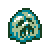</div> | **The Dough Jones Plunge** | Have **$1 million** in stock market losses in one ascension<br>&nbsp;<br>&nbsp; |
| <div style="width:48px;height:48px;overflow:hidden;display:inline-block;"></div> | **Broiler room** | Hire at least **100** stockbrokers in the Stock Market<br>&nbsp;<br>&nbsp; |

#### Garden
| <div style="min-width:48px;max-width:48px;width:48px">Icon</div> | Achievement Name | Requirement |
| :---: | --- | --- |
| <div style="width:48px;height:48px;overflow:hidden;display:inline-block;">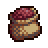</div> | **Seedless to eternity** | Convert a complete seed log into sugar lumps by sacrificing your garden to the sugar hornets **5 times**<br>&nbsp;<br>&nbsp; |
| <div style="width:48px;height:48px;overflow:hidden;display:inline-block;">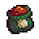</div> | **Seedless to infinity** | Convert a complete seed log into sugar lumps by sacrificing your garden to the sugar hornets **10 times**<br>&nbsp;<br>&nbsp; |
| <div style="width:48px;height:48px;overflow:hidden;display:inline-block;">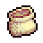</div> | **Seedless to beyond** | Convert a complete seed log into sugar lumps by sacrificing your garden to the sugar hornets **25 times**<br>&nbsp;<br>&nbsp; |
| <div style="width:48px;height:48px;overflow:hidden;display:inline-block;">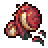</div> | **Greener, aching thumb** | Harvest **2,000 mature garden plants** across all ascensions<br>&nbsp;<br>&nbsp; |
| <div style="width:48px;height:48px;overflow:hidden;display:inline-block;">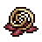</div> | **Greenest, aching thumb** | Harvest **3,000 mature garden plants** across all ascensions<br>&nbsp;<br>&nbsp; |
| <div style="width:48px;height:48px;overflow:hidden;display:inline-block;"></div> | **Photosynthetic prodigy** | Harvest **5,000 mature garden plants** across all ascensions<br>&nbsp;<br>&nbsp; |
| <div style="width:48px;height:48px;overflow:hidden;display:inline-block;"></div> | **Garden master** | Harvest **7,500 mature garden plants** across all ascensions<br>&nbsp;<br>&nbsp; |
| <div style="width:48px;height:48px;overflow:hidden;display:inline-block;">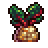</div> | **Plant whisperer** | Harvest **10,000 mature garden plants** across all ascensions<br>&nbsp;<br>&nbsp; |
| <div style="width:48px;height:48px;overflow:hidden;display:inline-block;">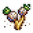</div> | **Botanical Perfection** | Have one of every type of plant in the mature stage at once<br>&nbsp;<br>&nbsp; |
| <div style="width:48px;height:48px;overflow:hidden;display:inline-block;">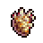</div> | **Duketater Salad** | Harvest **12 mature Duketaters** simultaneously<br>&nbsp;<br>&nbsp; |
| <div style="width:48px;height:48px;overflow:hidden;display:inline-block;">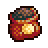</div> | **Fifty Shades of Clay** | Change the soil type of your Garden **100 times** in one ascension<br>&nbsp;<br>&nbsp; |
- See also **I feel the need for seed**

#### Grimoire
| <div style="min-width:48px;max-width:48px;width:48px">Icon</div> | Achievement Name | Requirement |
| :---: | --- | --- |
| <div style="width:48px;height:48px;overflow:hidden;display:inline-block;">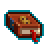</div> | **Archwizard** | Cast **1,999 spells** across all ascensions<br>&nbsp;<br>&nbsp; |
| <div style="width:48px;height:48px;overflow:hidden;display:inline-block;">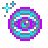</div> | **Spellmaster** | Cast **2,999 spells** across all ascensions<br>&nbsp;<br>&nbsp; |
| <div style="width:48px;height:48px;overflow:hidden;display:inline-block;">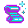</div> | **Cookieomancer** | Cast **3,999 spells** across all ascensions<br>&nbsp;<br>&nbsp; |
| <div style="width:48px;height:48px;overflow:hidden;display:inline-block;"></div> | **Spell lord** | Cast **4,999 spells** across all ascensions<br>&nbsp;<br>&nbsp; |
| <div style="width:48px;height:48px;overflow:hidden;display:inline-block;">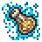</div> | **Magic emperor** | Cast **9,999 spells** across all ascensions<br>&nbsp;<br>&nbsp; |
| <div style="width:48px;height:48px;overflow:hidden;display:inline-block;"></div> | **Hogwarts Graduate** | Have **3 positive Grimoire spell effects** active at once<br>&nbsp;<br>&nbsp; |
| <div style="width:48px;height:48px;overflow:hidden;display:inline-block;"></div> | **Hogwarts Dropout** | Have **3 negative Grimoire spell effects** active at once<br>&nbsp;<br>&nbsp; |
| <div style="width:48px;height:48px;overflow:hidden;display:inline-block;"></div> | **Spell Slinger** | Cast **10 spells** within a 10-second window<br>&nbsp;<br>&nbsp; |
| <div style="width:48px;height:48px;overflow:hidden;display:inline-block;"></div> | **Sweet Sorcery** | Get the **Free Sugar Lump** outcome from a magically spawned golden cookie<br>&nbsp;<br>&nbsp; |

#### Pantheon
| <div style="min-width:48px;max-width:48px;width:48px">Icon</div> | Achievement Name | Requirement |
| :---: | --- | --- |
| <div style="width:48px;height:48px;overflow:hidden;display:inline-block;">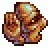</div> | **Faithless Loyalty** | Swap gods in the Pantheon **100 times** in one ascension<br>&nbsp;<br>&nbsp; |
| <div style="width:48px;height:48px;overflow:hidden;display:inline-block;"></div> | **God of All Gods** | Use each pantheon god for at least **24 hours** total across all ascensions<br>&nbsp;<br>&nbsp; |

### Seasonal Achievements (9 achievements)
| <div style="min-width:48px;max-width:48px;width:48px">Icon</div> | Achievement Name | Requirement |
| :---: | --- | --- |
| <div style="width:48px;height:48px;overflow:hidden;display:inline-block;"></div> | **Calendar Abuser** | Switch seasons **50 times** in one ascension<br>&nbsp;<br>&nbsp; |
| <div style="width:48px;height:48px;overflow:hidden;display:inline-block;">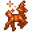</div> | **Reindeer destroyer** | Pop **500 reindeer** across all ascensions<br>&nbsp;<br>&nbsp; |
| <div style="width:48px;height:48px;overflow:hidden;display:inline-block;"></div> | **Reindeer obliterator** | Pop **1,000 reindeer** across all ascensions<br>&nbsp;<br>&nbsp; |
| <div style="width:48px;height:48px;overflow:hidden;display:inline-block;"></div> | **Reindeer extinction event** | Pop **2,000 reindeer** across all ascensions<br>&nbsp;<br>&nbsp; |
| <div style="width:48px;height:48px;overflow:hidden;display:inline-block;">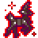</div> | **Reindeer apocalypse** | Pop **5,000 reindeer** across all ascensions<br>&nbsp;<br>&nbsp; |
| <div style="width:48px;height:48px;overflow:hidden;display:inline-block;">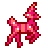</div> | **Cupid's Reindeer** | Pop a reindeer during **Valentine's Day season**<br>&nbsp;<br>&nbsp; |
| <div style="width:48px;height:48px;overflow:hidden;display:inline-block;">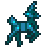</div> | **Business Reindeer** | Pop a reindeer during **Business Day season**<br>&nbsp;<br>&nbsp; |
| <div style="width:48px;height:48px;overflow:hidden;display:inline-block;">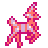</div> | **Bundeer** | Pop a reindeer during **Easter season**<br>&nbsp;<br>&nbsp; |
| <div style="width:48px;height:48px;overflow:hidden;display:inline-block;">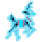</div> | **Ghost Reindeer** | Pop a reindeer during **Halloween season**<br>&nbsp;<br>&nbsp; |
- See also **Holiday Hoover** and **Merry Mayhem**

### Completionist Achievements (7 achievements)
| <div style="min-width:48px;max-width:48px;width:48px">Icon</div> | Achievement Name | Requirement |
| :---: | --- | --- |
| <div style="width:48px;height:48px;overflow:hidden;display:inline-block;"></div> | **Vanilla Star** | Own all **622 original achievements**<br>&nbsp;<br>&nbsp; |
| <div style="width:48px;height:48px;overflow:hidden;display:inline-block;"></div> | **Sweet Child of Mine** | Own **100 sugar lumps** at once<br>&nbsp;<br>&nbsp; |
| <div style="width:48px;height:48px;overflow:hidden;display:inline-block;"></div> | **Beyond Prestige** | Own all **129 original heavenly upgrades**<br>&nbsp;<br>&nbsp; |
| <div style="width:48px;height:48px;overflow:hidden;display:inline-block;"></div> | **Kitten jamboree** | Own all **18 original kittens**<br>&nbsp;<br>&nbsp; |
| <div style="width:48px;height:48px;overflow:hidden;display:inline-block;"></div> | **Kitten Fiesta** | Own all **18 original kittens** and all **11 expansion kittens** at once<br>&nbsp;<br>&nbsp; |
| <div style="width:48px;height:48px;overflow:hidden;display:inline-block;"></div> | **Bearer of the Cookie Sigil** | Fully initiate into the Great Orders of the Cookie Age. Provides **25% faster research** and **10% more random drops** (See Upgrades Section for More Info)<br>&nbsp;<br>&nbsp; |
| <div style="width:48px;height:48px;overflow:hidden;display:inline-block;"></div> | **In the Shadows** | Unlock all vanilla shadow achievements, except that one.<br>&nbsp;<br>&nbsp; |
- See also **The Final Challenger**

### Combo Achievements (7 achievements)
| <div style="min-width:48px;max-width:48px;width:48px">Icon</div> | Achievement Name | Requirement |
| :---: | --- | --- |
| <div style="width:48px;height:48px;overflow:hidden;display:inline-block;">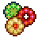</div> | **Trifecta Combo** | Have **3 buffs** active at once<br>&nbsp;<br>&nbsp; |
| <div style="width:48px;height:48px;overflow:hidden;display:inline-block;"></div> | **Combo Initiate** | Have **6 buffs** active at once<br>&nbsp;<br>&nbsp; |
| <div style="width:48px;height:48px;overflow:hidden;display:inline-block;"></div> | **Combo God** | Have **9 buffs** active at once<br>&nbsp;<br>&nbsp; |
| <div style="width:48px;height:48px;overflow:hidden;display:inline-block;"></div> | **Combo Hacker** | Have **12 buffs** active at once<br>&nbsp;<br>&nbsp; |
| <div style="width:48px;height:48px;overflow:hidden;display:inline-block;"></div> | **Frenzy frenzy** | Have all three frenzy buffs active at once<br>&nbsp;<br>&nbsp; |
| <div style="width:48px;height:48px;overflow:hidden;display:inline-block;">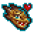</div> | **Double Dragon Clicker** | Have a dragon flight and a click frenzy active at the same time<br>&nbsp;<br>&nbsp; |
| <div style="width:48px;height:48px;overflow:hidden;display:inline-block;"></div> | **Frenzy Marathon** | Have a frenzy buff with a total duration of at least **10 minutes**<br>&nbsp;<br>&nbsp; |

### CPS Achievements (9 achievements)
| <div style="min-width:48px;max-width:48px;width:48px">Icon</div> | Achievement Name | Requirement |
| :---: | --- | --- |
| <div style="width:48px;height:48px;overflow:hidden;display:inline-block;"></div> | **Beyond the speed of dough** | Bake **1 octodecillion** per second<br>&nbsp;<br>&nbsp; |
| <div style="width:48px;height:48px;overflow:hidden;display:inline-block;"></div> | **Speed of sound** | Bake **10 octodecillion** per second<br>&nbsp;<br>&nbsp; |
| <div style="width:48px;height:48px;overflow:hidden;display:inline-block;"></div> | **Speed of light** | Bake **100 octodecillion** per second<br>&nbsp;<br>&nbsp; |
| <div style="width:48px;height:48px;overflow:hidden;display:inline-block;"></div> | **Faster than light** | Bake **1 novemdecillion** per second<br>&nbsp;<br>&nbsp; |
| <div style="width:48px;height:48px;overflow:hidden;display:inline-block;"></div> | **Speed of thought** | Bake **10 novemdecillion** per second<br>&nbsp;<br>&nbsp; |
| <div style="width:48px;height:48px;overflow:hidden;display:inline-block;"></div> | **Faster than speed of thought** | Bake **100 novemdecillion** per second<br>&nbsp;<br>&nbsp; |
| <div style="width:48px;height:48px;overflow:hidden;display:inline-block;">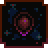</div> | **Plaid** | Bake **1 vigintillion** per second<br>&nbsp;<br>&nbsp; |
| <div style="width:48px;height:48px;overflow:hidden;display:inline-block;">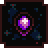</div> | **Somehow faster than plaid** | Bake **10 vigintillion** per second<br>&nbsp;<br>&nbsp; |
| <div style="width:48px;height:48px;overflow:hidden;display:inline-block;"></div> | **Transcending the very concept of speed itself** | Bake **100 vigintillion** per second<br>&nbsp;<br>&nbsp; |

### Click Achievements (9 achievements)
| <div style="min-width:48px;max-width:48px;width:48px">Icon</div> | Achievement Name | Requirement |
| :---: | --- | --- |
| <div style="width:48px;height:48px;overflow:hidden;display:inline-block;"></div> | **Click of the Titans** | Generate **1 year of raw CPS** in a single cookie click<br>&nbsp;<br>&nbsp; |
| <div style="width:48px;height:48px;overflow:hidden;display:inline-block;"></div> | **Buff Finger** | Click the cookie **250,000 times** across all ascensions<br>&nbsp;<br>&nbsp; |
| <div style="width:48px;height:48px;overflow:hidden;display:inline-block;"></div> | **News ticker addict** | Click on the news ticker **1,000 times** in one ascension<br>&nbsp;<br>&nbsp; |
| <div style="width:48px;height:48px;overflow:hidden;display:inline-block;"></div> | **Clickbait & Switch** | Make **1 vigintillion** from clicking<br>&nbsp;<br>&nbsp; |
| <div style="width:48px;height:48px;overflow:hidden;display:inline-block;"></div> | **Click to the Future** | Make **1 duovigintillion** from clicking<br>&nbsp;<br>&nbsp; |
| <div style="width:48px;height:48px;overflow:hidden;display:inline-block;"></div> | **Clickety Clique** | Make **1 quattuorvigintillion** from clicking<br>&nbsp;<br>&nbsp; |
| <div style="width:48px;height:48px;overflow:hidden;display:inline-block;"></div> | **Clickonomicon** | Make **1 sexvigintillion** from clicking<br>&nbsp;<br>&nbsp; |
| <div style="width:48px;height:48px;overflow:hidden;display:inline-block;">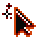</div> | **Clicks and Stones** | Make **1 octovigintillion** from clicking<br>&nbsp;<br>&nbsp; |
| <div style="width:48px;height:48px;overflow:hidden;display:inline-block;">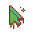</div> | **Click It Till You Make It** | Make **1 trigintillion** from clicking<br>&nbsp;<br>&nbsp; |

### Grandmapocalypse Achievements (15 achievements)
| <div style="min-width:48px;max-width:48px;width:48px">Icon</div> | Achievement Name | Requirement |
| :---: | --- | --- |
| <div style="width:48px;height:48px;overflow:hidden;display:inline-block;">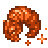</div> | **Wrinkler annihilator** | Burst **666 wrinklers** across all ascensions<br>&nbsp;<br>&nbsp; |
| <div style="width:48px;height:48px;overflow:hidden;display:inline-block;"></div> | **Wrinkler eradicator** | Burst **2,666 wrinklers** across all ascensions<br>&nbsp;<br>&nbsp; |
| <div style="width:48px;height:48px;overflow:hidden;display:inline-block;">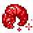</div> | **Wrinkler extinction event** | Burst **6,666 wrinklers** across all ascensions<br>&nbsp;<br>&nbsp; |
| <div style="width:48px;height:48px;overflow:hidden;display:inline-block;">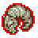</div> | **Wrinkler apocalypse** | Burst **16,666 wrinklers** across all ascensions<br>&nbsp;<br>&nbsp; |
| <div style="width:48px;height:48px;overflow:hidden;display:inline-block;">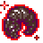</div> | **Wrinkler armageddon** | Burst **26,666 wrinklers** across all ascensions<br>&nbsp;<br>&nbsp; |
| <div style="width:48px;height:48px;overflow:hidden;display:inline-block;"></div> | **Rare specimen collector** | Burst **2 shiny wrinklers** across all ascensions<br>&nbsp;<br>&nbsp; |
| <div style="width:48px;height:48px;overflow:hidden;display:inline-block;"></div> | **Endangered species hunter** | Burst **5 shiny wrinklers** across all ascensions<br>&nbsp;<br>&nbsp; |
| <div style="width:48px;height:48px;overflow:hidden;display:inline-block;"></div> | **Extinction event architect** | Burst **10 shiny wrinklers** across all ascensions<br>&nbsp;<br>&nbsp; |
| <div style="width:48px;height:48px;overflow:hidden;display:inline-block;"></div> | **Golden wrinkler** | Burst a wrinkler worth **6.66 years of CPS**<br>&nbsp;<br>&nbsp; |
| <div style="width:48px;height:48px;overflow:hidden;display:inline-block;">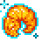</div> | **Wrinkler Rush** | Pop a wrinkler within **15 minutes and 30 seconds** of ascending<br>&nbsp;<br>&nbsp; |
| <div style="width:48px;height:48px;overflow:hidden;display:inline-block;">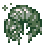</div> | **Wrinkler Windfall** | Sextuple (6x) your bank with a single wrinkler pop<br>&nbsp;<br>&nbsp; |
| <div style="width:48px;height:48px;overflow:hidden;display:inline-block;"></div> | **Deep elder nap** | Quash the grandmatriarchs one way or another **666 times** across all ascensions<br>&nbsp;<br>&nbsp; |
| <div style="width:48px;height:48px;overflow:hidden;display:inline-block;"></div> | **Warm-Up Ritual** | Click **66 wrath cookies** across all ascensions<br>&nbsp;<br>&nbsp; |
| <div style="width:48px;height:48px;overflow:hidden;display:inline-block;"></div> | **Deal of the Slightly Damned** | Click **666 wrath cookies** across all ascensions<br>&nbsp;<br>&nbsp; |
| <div style="width:48px;height:48px;overflow:hidden;display:inline-block;"></div> | **Baker of the Beast** | Click **6,666 wrath cookies** across all ascensions<br>&nbsp;<br>&nbsp; |

### Golden Cookie Achievements (6 achievements)
| <div style="min-width:48px;max-width:48px;width:48px">Icon</div> | Achievement Name | Requirement |
| :---: | --- | --- |
| <div style="width:48px;height:48px;overflow:hidden;display:inline-block;"></div> | **Find a penny, pick it up** | Click **17,777 golden cookies** across all ascensions<br>&nbsp;<br>&nbsp; |
| <div style="width:48px;height:48px;overflow:hidden;display:inline-block;"></div> | **Four-leaf overkill** | Click **37,777 golden cookies** across all ascensions<br>&nbsp;<br>&nbsp; |
| <div style="width:48px;height:48px;overflow:hidden;display:inline-block;">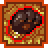</div> | **Rabbit's footnote** | Click **47,777 golden cookies** across all ascensions<br>&nbsp;<br>&nbsp; |
| <div style="width:48px;height:48px;overflow:hidden;display:inline-block;"></div> | **Knock on wood** | Click **57,777 golden cookies** across all ascensions<br>&nbsp;<br>&nbsp; |
| <div style="width:48px;height:48px;overflow:hidden;display:inline-block;"></div> | **Jackpot jubilee** | Click **67,777 golden cookies** across all ascensions<br>&nbsp;<br>&nbsp; |
| <div style="width:48px;height:48px;overflow:hidden;display:inline-block;">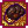</div> | **Black cat's seventh paw** | Click **77,777 golden cookies** across all ascensions<br>&nbsp;<br>&nbsp; |
- See also **Gilded Restraint** and **Second Life, First Click**

### Cookies Baked In Ascension Achievements (7 achievements)
| <div style="min-width:48px;max-width:48px;width:48px">Icon</div> | Achievement Name | Requirement |
| :---: | --- | --- |
| <div style="width:48px;height:48px;overflow:hidden;display:inline-block;"></div> | **The Doughpocalypse** | Bake **10 trevigintillion cookies** in one ascension<br>&nbsp;<br>&nbsp; |
| <div style="width:48px;height:48px;overflow:hidden;display:inline-block;"></div> | **The Flour Flood** | Bake **1 quattuorvigintillion cookies** in one ascension<br>&nbsp;<br>&nbsp; |
| <div style="width:48px;height:48px;overflow:hidden;display:inline-block;"></div> | **The Ovenverse** | Bake **100 quattuorvigintillion cookies** in one ascension<br>&nbsp;<br>&nbsp; |
| <div style="width:48px;height:48px;overflow:hidden;display:inline-block;"></div> | **The Crumb Crusade** | Bake **10 quinvigintillion cookies** in one ascension<br>&nbsp;<br>&nbsp; |
| <div style="width:48px;height:48px;overflow:hidden;display:inline-block;"></div> | **The Final Batch** | Bake **1 sexvigintillion cookies** in one ascension<br>&nbsp;<br>&nbsp; |
| <div style="width:48px;height:48px;overflow:hidden;display:inline-block;"></div> | **The Ultimate Ascension** | Bake **100 sexvigintillion cookies** in one ascension<br>&nbsp;<br>&nbsp; |
| <div style="width:48px;height:48px;overflow:hidden;display:inline-block;"></div> | **The Transcendent Rise** | Bake **10 septenvigintillion cookies** in one ascension<br>&nbsp;<br>&nbsp; |

### Forfeited Cookies Achievements (13 achievements)
| <div style="min-width:48px;max-width:48px;width:48px">Icon</div> | Achievement Name | Requirement |
| :---: | --- | --- |
| <div style="width:48px;height:48px;overflow:hidden;display:inline-block;"></div> | **Dante's unwaking dream** | Forfeit **1 novemdecillion cookies** total across all ascensions<br>&nbsp;<br>&nbsp; |
| <div style="width:48px;height:48px;overflow:hidden;display:inline-block;"></div> | **The abyss gazes back** | Forfeit **1 vigintillion cookies** total across all ascensions<br>&nbsp;<br>&nbsp; |
| <div style="width:48px;height:48px;overflow:hidden;display:inline-block;"></div> | **Charon's final toll** | Forfeit **1 unvigintillion cookies** total across all ascensions<br>&nbsp;<br>&nbsp; |
| <div style="width:48px;height:48px;overflow:hidden;display:inline-block;"></div> | **Cerberus's third head** | Forfeit **1 duovigintillion cookies** total across all ascensions<br>&nbsp;<br>&nbsp; |
| <div style="width:48px;height:48px;overflow:hidden;display:inline-block;">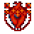</div> | **Minos's eternal judgment** | Forfeit **1 trevigintillion cookies** total across all ascensions<br>&nbsp;<br>&nbsp; |
| <div style="width:48px;height:48px;overflow:hidden;display:inline-block;">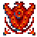</div> | **The river Styx flows backward** | Forfeit **1 quattuorvigintillion cookies** total across all ascensions<br>&nbsp;<br>&nbsp; |
| <div style="width:48px;height:48px;overflow:hidden;display:inline-block;"></div> | **Ixion's wheel spins faster** | Forfeit **1 quinvigintillion cookies** total across all ascensions<br>&nbsp;<br>&nbsp; |
| <div style="width:48px;height:48px;overflow:hidden;display:inline-block;"></div> | **Sisyphus's boulder crumbles** | Forfeit **1 sexvigintillion cookies** total across all ascensions<br>&nbsp;<br>&nbsp; |
| <div style="width:48px;height:48px;overflow:hidden;display:inline-block;"></div> | **Tantalus's eternal thirst** | Forfeit **1 septenvigintillion cookies** total across all ascensions<br>&nbsp;<br>&nbsp; |
| <div style="width:48px;height:48px;overflow:hidden;display:inline-block;"></div> | **The ninth circle's center** | Forfeit **1 octovigintillion cookies** total across all ascensions<br>&nbsp;<br>&nbsp; |
| <div style="width:48px;height:48px;overflow:hidden;display:inline-block;"></div> | **Lucifer's frozen tears** | Forfeit **1 novemvigintillion cookies** total across all ascensions<br>&nbsp;<br>&nbsp; |
| <div style="width:48px;height:48px;overflow:hidden;display:inline-block;"></div> | **Beyond the void's edge** | Forfeit **1 trigintillion cookies** total across all ascensions<br>&nbsp;<br>&nbsp; |
| <div style="width:48px;height:48px;overflow:hidden;display:inline-block;"></div> | **The final descent's end** | Forfeit **1 untrigintillion cookies** total across all ascensions<br>&nbsp;<br>&nbsp; |

### Building Ownership Achievements (13 achievements)
| <div style="min-width:48px;max-width:48px;width:48px">Icon</div> | Achievement Name | Requirement |
| :---: | --- | --- |
| <div style="width:48px;height:48px;overflow:hidden;display:inline-block;"></div> | **Septcentennial and a half** | Have at least **750 of everything**<br>&nbsp;<br>&nbsp; |
| <div style="width:48px;height:48px;overflow:hidden;display:inline-block;">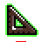</div> | **Octcentennial** | Have at least **800 of everything**<br>&nbsp;<br>&nbsp; |
| <div style="width:48px;height:48px;overflow:hidden;display:inline-block;">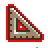</div> | **Octcentennial and a half** | Have at least **850 of everything**<br>&nbsp;<br>&nbsp; |
| <div style="width:48px;height:48px;overflow:hidden;display:inline-block;">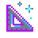</div> | **Nonacentennial** | Have at least **900 of everything**<br>&nbsp;<br>&nbsp; |
| <div style="width:48px;height:48px;overflow:hidden;display:inline-block;">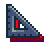</div> | **Nonacentennial and a half** | Have at least **950 of everything**<br>&nbsp;<br>&nbsp; |
| <div style="width:48px;height:48px;overflow:hidden;display:inline-block;">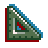</div> | **Millennial** | Have at least **1,000 of everything**<br>&nbsp;<br>&nbsp; |
| <div style="width:48px;height:48px;overflow:hidden;display:inline-block;"></div> | **Building behemoth** | Own **15,000 buildings**<br>&nbsp;<br>&nbsp; |
| <div style="width:48px;height:48px;overflow:hidden;display:inline-block;"></div> | **Construction colossus** | Own **20,000 buildings**<br>&nbsp;<br>&nbsp; |
| <div style="width:48px;height:48px;overflow:hidden;display:inline-block;"></div> | **Architectural apex** | Own **25,000 buildings**<br>&nbsp;<br>&nbsp; |
| <div style="width:48px;height:48px;overflow:hidden;display:inline-block;"></div> | **Asset Liquidator** | Sell **25,000 buildings** in one ascension<br>&nbsp;<br>&nbsp; |
| <div style="width:48px;height:48px;overflow:hidden;display:inline-block;"></div> | **Flip City** | Sell **50,000 buildings** in one ascension<br>&nbsp;<br>&nbsp; |
| <div style="width:48px;height:48px;overflow:hidden;display:inline-block;"></div> | **Ghost Town Tycoon** | Sell **100,000 buildings** in one ascension<br>&nbsp;<br>&nbsp; |
| <div style="width:48px;height:48px;overflow:hidden;display:inline-block;">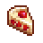</div> | **Have your sugar and eat it too** | Have every building reach **level 10**<br>&nbsp;<br>&nbsp; |
- See also **The Final Countdown**, **Back to Basic Bakers**, **Modest Portfolio**, **Difficult Decisions**, and **Treading water**

### Reincarnation Achievements (3 achievements)
| <div style="min-width:48px;max-width:48px;width:48px">Icon</div> | Achievement Name | Requirement |
| :---: | --- | --- |
| <div style="width:48px;height:48px;overflow:hidden;display:inline-block;">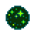</div> | **Ascension master** | Ascend **250 times**<br>&nbsp;<br>&nbsp; |
| <div style="width:48px;height:48px;overflow:hidden;display:inline-block;"></div> | **Ascension legend** | Ascend **500 times**<br>&nbsp;<br>&nbsp; |
| <div style="width:48px;height:48px;overflow:hidden;display:inline-block;"></div> | **Ascension deity** | Ascend **999 times**<br>&nbsp;<br>&nbsp; |

#### Cursor (16 Achievements)
| <div style="min-width:48px;max-width:48px;width:48px">Icon</div> | Achievement | Requirement |
| :---: | --- | --- |
| <div style="width:48px;height:48px;overflow:hidden;display:inline-block;"></div> | **Carpal diem** | Own **1,100 cursors**<br>&nbsp;<br>&nbsp; |
| <div style="width:48px;height:48px;overflow:hidden;display:inline-block;"></div> | **Hand over fist** | Own **1,150 cursors**<br>&nbsp;<br>&nbsp; |
| <div style="width:48px;height:48px;overflow:hidden;display:inline-block;"></div> | **Finger guns** | Own **1,250 cursors**<br>&nbsp;<br>&nbsp; |
| <div style="width:48px;height:48px;overflow:hidden;display:inline-block;"></div> | **Thumbs up, buttercup** | Own **1,300 cursors**<br>&nbsp;<br>&nbsp; |
| <div style="width:48px;height:48px;overflow:hidden;display:inline-block;"></div> | **Pointer sisters** | Own **1,400 cursors**<br>&nbsp;<br>&nbsp; |
| <div style="width:48px;height:48px;overflow:hidden;display:inline-block;"></div> | **Knuckle sandwich** | Own **1,450 cursors**<br>&nbsp;<br>&nbsp; |
| <div style="width:48px;height:48px;overflow:hidden;display:inline-block;"></div> | **Phalanx formation** | Own **1,550 cursors**<br>&nbsp;<br>&nbsp; |
| <div style="width:48px;height:48px;overflow:hidden;display:inline-block;"></div> | **Manual override** | Own **1,600 cursors**<br>&nbsp;<br>&nbsp; |
| <div style="width:48px;height:48px;overflow:hidden;display:inline-block;"></div> | **Clickbaiter-in-chief** | Own **1,700 cursors**<br>&nbsp;<br>&nbsp; |
| <div style="width:48px;height:48px;overflow:hidden;display:inline-block;"></div> | **With flying digits** | Own **1,750 cursors**<br>&nbsp;<br>&nbsp; |
| <div style="width:48px;height:48px;overflow:hidden;display:inline-block;">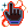</div> | **Palm before the storm** | Own **1,850 cursors**<br>&nbsp;<br>&nbsp; |
| <div style="width:48px;height:48px;overflow:hidden;display:inline-block;"></div> | **Click II: the sequel** | Make **1 septendecillion cookies** just from cursors<br>&nbsp;<br>&nbsp; |
| <div style="width:48px;height:48px;overflow:hidden;display:inline-block;"></div> | **Click III: we couldn't get Adam so it stars Jerry Seinfeld for some reason** | Make **1 quindecillion cookies** just from cursors<br>&nbsp;<br>&nbsp; |
| <div style="width:48px;height:48px;overflow:hidden;display:inline-block;"></div> | **Click IV: 3% on rotten tomatoes** | Make **1 sexdecillion cookies** just from cursors<br>&nbsp;<br>&nbsp; |
| <div style="width:48px;height:48px;overflow:hidden;display:inline-block;"></div> | **Rowdy shadow puppets** | Reach **level 15** Cursors<br>&nbsp;<br>&nbsp; |
| <div style="width:48px;height:48px;overflow:hidden;display:inline-block;"></div> | **Frantic finger guns** | Reach **level 20** Cursors<br>&nbsp;<br>&nbsp; |

#### Grandma (16 Achievements)
| <div style="min-width:48px;max-width:48px;width:48px">Icon</div> | Achievement | Requirement |
| :---: | --- | --- |
| <div style="width:48px;height:48px;overflow:hidden;display:inline-block;"></div> | **All rise for Nana** | Own **750 grandmas**<br>&nbsp;<br>&nbsp; |
| <div style="width:48px;height:48px;overflow:hidden;display:inline-block;"></div> | **The crinkle collective** | Own **800 grandmas**<br>&nbsp;<br>&nbsp; |
| <div style="width:48px;height:48px;overflow:hidden;display:inline-block;"></div> | **Okay elder** | Own **850 grandmas**<br>&nbsp;<br>&nbsp; |
| <div style="width:48px;height:48px;overflow:hidden;display:inline-block;"></div> | **Wrinkle monarchy** | Own **900 grandmas**<br>&nbsp;<br>&nbsp; |
| <div style="width:48px;height:48px;overflow:hidden;display:inline-block;"></div> | **The wrinkling hour** | Own **950 grandmas**<br>&nbsp;<br>&nbsp; |
| <div style="width:48px;height:48px;overflow:hidden;display:inline-block;">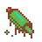</div> | **Matriarchal meltdown** | Own **1,000 grandmas**<br>&nbsp;<br>&nbsp; |
| <div style="width:48px;height:48px;overflow:hidden;display:inline-block;">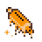</div> | **Cookies before crones** | Own **1,050 grandmas**<br>&nbsp;<br>&nbsp; |
| <div style="width:48px;height:48px;overflow:hidden;display:inline-block;">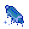</div> | **Dust to crust** | Own **1,100 grandmas**<br>&nbsp;<br>&nbsp; |
| <div style="width:48px;height:48px;overflow:hidden;display:inline-block;">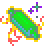</div> | **Bingo bloodbath** | Own **1,150 grandmas**<br>&nbsp;<br>&nbsp; |
| <div style="width:48px;height:48px;overflow:hidden;display:inline-block;">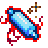</div> | **Supreme doughmother** | Own **1,200 grandmas**<br>&nbsp;<br>&nbsp; |
| <div style="width:48px;height:48px;overflow:hidden;display:inline-block;"></div> | **The last custodian** | Own **1,250 grandmas**<br>&nbsp;<br>&nbsp; |
| <div style="width:48px;height:48px;overflow:hidden;display:inline-block;"></div> | **Scone with the wind** | Make **1 septendecillion cookies** just from grandmas<br>&nbsp;<br>&nbsp; |
| <div style="width:48px;height:48px;overflow:hidden;display:inline-block;"></div> | **The flour of youth** | Make **1 quindecillion cookies** just from grandmas<br>&nbsp;<br>&nbsp; |
| <div style="width:48px;height:48px;overflow:hidden;display:inline-block;"></div> | **Bake-ageddon** | Make **1 sexdecillion cookies** just from grandmas<br>&nbsp;<br>&nbsp; |
| <div style="width:48px;height:48px;overflow:hidden;display:inline-block;"></div> | **Loaf & behold** | Reach **level 15** Grandmas<br>&nbsp;<br>&nbsp; |
| <div style="width:48px;height:48px;overflow:hidden;display:inline-block;"></div> | **Forbidden fruitcake** | Reach **level 20** Grandmas<br>&nbsp;<br>&nbsp; |

#### Farm (16 Achievements)
| <div style="min-width:48px;max-width:48px;width:48px">Icon</div> | Achievement | Requirement |
| :---: | --- | --- |
| <div style="width:48px;height:48px;overflow:hidden;display:inline-block;"></div> | **Little house on the dairy** | Own **750 farms**<br>&nbsp;<br>&nbsp; |
| <div style="width:48px;height:48px;overflow:hidden;display:inline-block;"></div> | **The plow thickens** | Own **800 farms**<br>&nbsp;<br>&nbsp; |
| <div style="width:48px;height:48px;overflow:hidden;display:inline-block;"></div> | **Cabbage patch dynasty** | Own **850 farms**<br>&nbsp;<br>&nbsp; |
| <div style="width:48px;height:48px;overflow:hidden;display:inline-block;"></div> | **Grazing amazement** | Own **900 farms**<br>&nbsp;<br>&nbsp; |
| <div style="width:48px;height:48px;overflow:hidden;display:inline-block;"></div> | **Field of creams** | Own **950 farms**<br>&nbsp;<br>&nbsp; |
| <div style="width:48px;height:48px;overflow:hidden;display:inline-block;"></div> | **Barn to be wild** | Own **1,000 farms**<br>&nbsp;<br>&nbsp; |
| <div style="width:48px;height:48px;overflow:hidden;display:inline-block;"></div> | **Crops and robbers** | Own **1,050 farms**<br>&nbsp;<br>&nbsp; |
| <div style="width:48px;height:48px;overflow:hidden;display:inline-block;"></div> | **Shoveling it in** | Own **1,100 farms**<br>&nbsp;<br>&nbsp; |
| <div style="width:48px;height:48px;overflow:hidden;display:inline-block;"></div> | **Seed syndicate** | Own **1,150 farms**<br>&nbsp;<br>&nbsp; |
| <div style="width:48px;height:48px;overflow:hidden;display:inline-block;"></div> | **Harvest high table** | Own **1,200 farms**<br>&nbsp;<br>&nbsp; |
| <div style="width:48px;height:48px;overflow:hidden;display:inline-block;"></div> | **Emperor of dirt** | Own **1,250 farms**<br>&nbsp;<br>&nbsp; |
| <div style="width:48px;height:48px;overflow:hidden;display:inline-block;"></div> | **Rake in the greens** | Make **1 quattuordecillion cookies** just from farms<br>&nbsp;<br>&nbsp; |
| <div style="width:48px;height:48px;overflow:hidden;display:inline-block;"></div> | **The great threshering** | Make **1 quindecillion cookies** just from farms<br>&nbsp;<br>&nbsp; |
| <div style="width:48px;height:48px;overflow:hidden;display:inline-block;"></div> | **Bushels of burden** | Make **1 sexdecillion cookies** just from farms<br>&nbsp;<br>&nbsp; |
| <div style="width:48px;height:48px;overflow:hidden;display:inline-block;"></div> | **Huge-er tracts of land** | Reach **level 15** Farms<br>&nbsp;<br>&nbsp; |
| <div style="width:48px;height:48px;overflow:hidden;display:inline-block;"></div> | **Hoedown showdown** | Reach **level 20** Farms<br>&nbsp;<br>&nbsp; |

#### Mine (16 Achievements)
| <div style="min-width:48px;max-width:48px;width:48px">Icon</div> | Achievement | Requirement |
| :---: | --- | --- |
| <div style="width:48px;height:48px;overflow:hidden;display:inline-block;"></div> | **Shafted** | Own **750 mines**<br>&nbsp;<br>&nbsp; |
| <div style="width:48px;height:48px;overflow:hidden;display:inline-block;"></div> | **Shiny object syndrome** | Own **800 mines**<br>&nbsp;<br>&nbsp; |
| <div style="width:48px;height:48px;overflow:hidden;display:inline-block;"></div> | **Ore what?** | Own **850 mines**<br>&nbsp;<br>&nbsp; |
| <div style="width:48px;height:48px;overflow:hidden;display:inline-block;"></div> | **Rubble without a cause** | Own **900 mines**<br>&nbsp;<br>&nbsp; |
| <div style="width:48px;height:48px;overflow:hidden;display:inline-block;"></div> | **Tunnel visionaries** | Own **950 mines**<br>&nbsp;<br>&nbsp; |
| <div style="width:48px;height:48px;overflow:hidden;display:inline-block;"></div> | **Stalag-might** | Own **1,000 mines**<br>&nbsp;<br>&nbsp; |
| <div style="width:48px;height:48px;overflow:hidden;display:inline-block;"></div> | **Pyrite and prejudice** | Own **1,050 mines**<br>&nbsp;<br>&nbsp; |
| <div style="width:48px;height:48px;overflow:hidden;display:inline-block;"></div> | **Bedrock 'n roll** | Own **1,100 mines**<br>&nbsp;<br>&nbsp; |
| <div style="width:48px;height:48px;overflow:hidden;display:inline-block;"></div> | **Mantle management** | Own **1,150 mines**<br>&nbsp;<br>&nbsp; |
| <div style="width:48px;height:48px;overflow:hidden;display:inline-block;"></div> | **Hollow crown jewels** | Own **1,200 mines**<br>&nbsp;<br>&nbsp; |
| <div style="width:48px;height:48px;overflow:hidden;display:inline-block;"></div> | **Emperor of ore** | Own **1,250 mines**<br>&nbsp;<br>&nbsp; |
| <div style="width:48px;height:48px;overflow:hidden;display:inline-block;"></div> | **Ore d'oeuvres** | Make **10 quattuordecillion cookies** just from mines<br>&nbsp;<br>&nbsp; |
| <div style="width:48px;height:48px;overflow:hidden;display:inline-block;"></div> | **Seismic yield** | Make **10 quindecillion cookies** just from mines<br>&nbsp;<br>&nbsp; |
| <div style="width:48px;height:48px;overflow:hidden;display:inline-block;"></div> | **Billionaire's bedrock** | Make **10 sexdecillion cookies** just from mines<br>&nbsp;<br>&nbsp; |
| <div style="width:48px;height:48px;overflow:hidden;display:inline-block;"></div> | **Cave-in king** | Reach **level 15** Mines<br>&nbsp;<br>&nbsp; |
| <div style="width:48px;height:48px;overflow:hidden;display:inline-block;"></div> | **Digging destiny** | Reach **level 20** Mines<br>&nbsp;<br>&nbsp; |

#### Factory (16 Achievements)
| <div style="min-width:48px;max-width:48px;width:48px">Icon</div> | Achievement | Requirement |
| :---: | --- | --- |
| <div style="width:48px;height:48px;overflow:hidden;display:inline-block;"></div> | **Assembly required** | Own **750 factories**<br>&nbsp;<br>&nbsp; |
| <div style="width:48px;height:48px;overflow:hidden;display:inline-block;"></div> | **Quality unassured** | Own **800 factories**<br>&nbsp;<br>&nbsp; |
| <div style="width:48px;height:48px;overflow:hidden;display:inline-block;"></div> | **Error 404-manpower not found** | Own **850 factories**<br>&nbsp;<br>&nbsp; |
| <div style="width:48px;height:48px;overflow:hidden;display:inline-block;"></div> | **Spare parts department** | Own **900 factories**<br>&nbsp;<br>&nbsp; |
| <div style="width:48px;height:48px;overflow:hidden;display:inline-block;"></div> | **Conveyor belters** | Own **950 factories**<br>&nbsp;<br>&nbsp; |
| <div style="width:48px;height:48px;overflow:hidden;display:inline-block;"></div> | **Planned obsolescence** | Own **1,000 factories**<br>&nbsp;<br>&nbsp; |
| <div style="width:48px;height:48px;overflow:hidden;display:inline-block;"></div> | **Punch-card prophets** | Own **1,050 factories**<br>&nbsp;<br>&nbsp; |
| <div style="width:48px;height:48px;overflow:hidden;display:inline-block;"></div> | **Rust in peace** | Own **1,100 factories**<br>&nbsp;<br>&nbsp; |
| <div style="width:48px;height:48px;overflow:hidden;display:inline-block;"></div> | **Algorithm and blues** | Own **1,150 factories**<br>&nbsp;<br>&nbsp; |
| <div style="width:48px;height:48px;overflow:hidden;display:inline-block;"></div> | **Profit motive engine** | Own **1,200 factories**<br>&nbsp;<br>&nbsp; |
| <div style="width:48px;height:48px;overflow:hidden;display:inline-block;"></div> | **Lord of the assembly** | Own **1,250 factories**<br>&nbsp;<br>&nbsp; |
| <div style="width:48px;height:48px;overflow:hidden;display:inline-block;"></div> | **Sweatshop symphony** | Make **100 quattuordecillion cookies** just from factories<br>&nbsp;<br>&nbsp; |
| <div style="width:48px;height:48px;overflow:hidden;display:inline-block;"></div> | **Cookieconomics 101** | Make **100 quindecillion cookies** just from factories<br>&nbsp;<br>&nbsp; |
| <div style="width:48px;height:48px;overflow:hidden;display:inline-block;"></div> | **Mass production messiah** | Make **100 sexdecillion cookies** just from factories<br>&nbsp;<br>&nbsp; |
| <div style="width:48px;height:48px;overflow:hidden;display:inline-block;"></div> | **Boilerplate overlord** | Reach **level 15** Factories<br>&nbsp;<br>&nbsp; |
| <div style="width:48px;height:48px;overflow:hidden;display:inline-block;"></div> | **Cookie standard time** | Reach **level 20** Factories<br>&nbsp;<br>&nbsp; |

#### Bank (16 Achievements)
| <div style="min-width:48px;max-width:48px;width:48px">Icon</div> | Achievement | Requirement |
| :---: | --- | --- |
| <div style="width:48px;height:48px;overflow:hidden;display:inline-block;"></div> | **Petty cash splash** | Own **750 banks**<br>&nbsp;<br>&nbsp; |
| <div style="width:48px;height:48px;overflow:hidden;display:inline-block;"></div> | **The Invisible Hand That Feeds** | Own **800 banks**<br>&nbsp;<br>&nbsp; |
| <div style="width:48px;height:48px;overflow:hidden;display:inline-block;"></div> | **Under-mattress banking** | Own **850 banks**<br>&nbsp;<br>&nbsp; |
| <div style="width:48px;height:48px;overflow:hidden;display:inline-block;"></div> | **Interest-ing times** | Own **900 banks**<br>&nbsp;<br>&nbsp; |
| <div style="width:48px;height:48px;overflow:hidden;display:inline-block;"></div> | **Fee-fi-fo-fund** | Own **950 banks**<br>&nbsp;<br>&nbsp; |
| <div style="width:48px;height:48px;overflow:hidden;display:inline-block;"></div> | **Liquidity theater** | Own **1,000 banks**<br>&nbsp;<br>&nbsp; |
| <div style="width:48px;height:48px;overflow:hidden;display:inline-block;"></div> | **Risk appetite: unlimited** | Own **1,050 banks**<br>&nbsp;<br>&nbsp; |
| <div style="width:48px;height:48px;overflow:hidden;display:inline-block;"></div> | **Quantitative cheesing** | Own **1,100 banks**<br>&nbsp;<br>&nbsp; |
| <div style="width:48px;height:48px;overflow:hidden;display:inline-block;"></div> | **Number go up economics** | Own **1,150 banks**<br>&nbsp;<br>&nbsp; |
| <div style="width:48px;height:48px;overflow:hidden;display:inline-block;"></div> | **Sovereign cookie fund** | Own **1,200 banks**<br>&nbsp;<br>&nbsp; |
| <div style="width:48px;height:48px;overflow:hidden;display:inline-block;"></div> | **Seigniorage supreme** | Own **1,250 banks**<br>&nbsp;<br>&nbsp; |
| <div style="width:48px;height:48px;overflow:hidden;display:inline-block;"></div> | **Compound interest, compounded** | Make **1 quindecillion cookies** just from banks<br>&nbsp;<br>&nbsp; |
| <div style="width:48px;height:48px;overflow:hidden;display:inline-block;"></div> | **Arbitrage avalanche** | Make **1 sexdecillion cookies** just from banks<br>&nbsp;<br>&nbsp; |
| <div style="width:48px;height:48px;overflow:hidden;display:inline-block;"></div> | **Ponzi à la mode** | Make **1 septendecillion cookies** just from banks<br>&nbsp;<br>&nbsp; |
| <div style="width:48px;height:48px;overflow:hidden;display:inline-block;"></div> | **Credit conjurer** | Reach **level 15** Banks<br>&nbsp;<br>&nbsp; |
| <div style="width:48px;height:48px;overflow:hidden;display:inline-block;"></div> | **Master of the Mint** | Reach **level 20** Banks<br>&nbsp;<br>&nbsp; |

#### Temple (16 Achievements)
| <div style="min-width:48px;max-width:48px;width:48px">Icon</div> | Achievement | Requirement |
| :---: | --- | --- |
| <div style="width:48px;height:48px;overflow:hidden;display:inline-block;"></div> | **Monk mode** | Own **750 temples**<br>&nbsp;<br>&nbsp; |
| <div style="width:48px;height:48px;overflow:hidden;display:inline-block;"></div> | **Ritual and error** | Own **800 temples**<br>&nbsp;<br>&nbsp; |
| <div style="width:48px;height:48px;overflow:hidden;display:inline-block;"></div> | **Chant and deliver** | Own **850 temples**<br>&nbsp;<br>&nbsp; |
| <div style="width:48px;height:48px;overflow:hidden;display:inline-block;"></div> | **Incensed and consecrated** | Own **900 temples**<br>&nbsp;<br>&nbsp; |
| <div style="width:48px;height:48px;overflow:hidden;display:inline-block;"></div> | **Shrine of the times** | Own **950 temples**<br>&nbsp;<br>&nbsp; |
| <div style="width:48px;height:48px;overflow:hidden;display:inline-block;"></div> | **Hallowed be thy grain** | Own **1,000 temples**<br>&nbsp;<br>&nbsp; |
| <div style="width:48px;height:48px;overflow:hidden;display:inline-block;"></div> | **Relic and roll** | Own **1,050 temples**<br>&nbsp;<br>&nbsp; |
| <div style="width:48px;height:48px;overflow:hidden;display:inline-block;"></div> | **Pilgrimage of crumbs** | Own **1,100 temples**<br>&nbsp;<br>&nbsp; |
| <div style="width:48px;height:48px;overflow:hidden;display:inline-block;"></div> | **The cookie pantheon** | Own **1,150 temples**<br>&nbsp;<br>&nbsp; |
| <div style="width:48px;height:48px;overflow:hidden;display:inline-block;"></div> | **Tithes and cookies** | Own **1,200 temples**<br>&nbsp;<br>&nbsp; |
| <div style="width:48px;height:48px;overflow:hidden;display:inline-block;"></div> | **Om-nom-nipotent** | Own **1,250 temples**<br>&nbsp;<br>&nbsp; |
| <div style="width:48px;height:48px;overflow:hidden;display:inline-block;"></div> | **Temple treasury overflow** | Make **10 quindecillion cookies** just from temples<br>&nbsp;<br>&nbsp; |
| <div style="width:48px;height:48px;overflow:hidden;display:inline-block;"></div> | **Pantheon payout** | Make **10 sexdecillion cookies** just from temples<br>&nbsp;<br>&nbsp; |
| <div style="width:48px;height:48px;overflow:hidden;display:inline-block;"></div> | **Sacred surplus** | Make **10 septendecillion cookies** just from temples<br>&nbsp;<br>&nbsp; |
| <div style="width:48px;height:48px;overflow:hidden;display:inline-block;"></div> | **Acolyte ascendant** | Reach **level 15** Temples<br>&nbsp;<br>&nbsp; |
| <div style="width:48px;height:48px;overflow:hidden;display:inline-block;"></div> | **Grand hierophant** | Reach **level 20** Temples<br>&nbsp;<br>&nbsp; |

#### Wizard Tower (16 Achievements)
| <div style="min-width:48px;max-width:48px;width:48px">Icon</div> | Achievement | Requirement |
| :---: | --- | --- |
| <div style="width:48px;height:48px;overflow:hidden;display:inline-block;"></div> | **Is this your cardamom?** | Own **750 wizard towers**<br>&nbsp;<br>&nbsp; |
| <div style="width:48px;height:48px;overflow:hidden;display:inline-block;"></div> | **Rabbit optional, hat mandatory** | Own **800 wizard towers**<br>&nbsp;<br>&nbsp; |
| <div style="width:48px;height:48px;overflow:hidden;display:inline-block;"></div> | **Wand and done** | Own **850 wizard towers**<br>&nbsp;<br>&nbsp; |
| <div style="width:48px;height:48px;overflow:hidden;display:inline-block;"></div> | **Critical spellcheck failed** | Own **900 wizard towers**<br>&nbsp;<br>&nbsp; |
| <div style="width:48px;height:48px;overflow:hidden;display:inline-block;"></div> | **Tome Raider** | Own **950 wizard towers**<br>&nbsp;<br>&nbsp; |
| <div style="width:48px;height:48px;overflow:hidden;display:inline-block;"></div> | **Prestidigitation station** | Own **1,000 wizard towers**<br>&nbsp;<br>&nbsp; |
| <div style="width:48px;height:48px;overflow:hidden;display:inline-block;"></div> | **Counterspell culture** | Own **1,050 wizard towers**<br>&nbsp;<br>&nbsp; |
| <div style="width:48px;height:48px;overflow:hidden;display:inline-block;"></div> | **Glitter is a material component** | Own **1,100 wizard towers**<br>&nbsp;<br>&nbsp; |
| <div style="width:48px;height:48px;overflow:hidden;display:inline-block;"></div> | **Evocation nation** | Own **1,150 wizard towers**<br>&nbsp;<br>&nbsp; |
| <div style="width:48px;height:48px;overflow:hidden;display:inline-block;"></div> | **Sphere of influence** | Own **1,200 wizard towers**<br>&nbsp;<br>&nbsp; |
| <div style="width:48px;height:48px;overflow:hidden;display:inline-block;"></div> | **The Last Archmage** | Own **1,250 wizard towers**<br>&nbsp;<br>&nbsp; |
| <div style="width:48px;height:48px;overflow:hidden;display:inline-block;"></div> | **Rabbits per minute** | Make **100 quindecillion cookies** just from wizard towers<br>&nbsp;<br>&nbsp; |
| <div style="width:48px;height:48px;overflow:hidden;display:inline-block;"></div> | **Hocus bonus** | Make **100 sexdecillion cookies** just from wizard towers<br>&nbsp;<br>&nbsp; |
| <div style="width:48px;height:48px;overflow:hidden;display:inline-block;"></div> | **Magic dividends** | Make **100 septendecillion cookies** just from wizard towers<br>&nbsp;<br>&nbsp; |
| <div style="width:48px;height:48px;overflow:hidden;display:inline-block;"></div> | **Archmage of Meringue** | Reach **level 15** Wizard Towers<br>&nbsp;<br>&nbsp; |
| <div style="width:48px;height:48px;overflow:hidden;display:inline-block;"></div> | **Chronomancer emeritus** | Reach **level 20** Wizard Towers<br>&nbsp;<br>&nbsp; |

#### Shipment (16 Achievements)
| <div style="min-width:48px;max-width:48px;width:48px">Icon</div> | Achievement | Requirement |
| :---: | --- | --- |
| <div style="width:48px;height:48px;overflow:hidden;display:inline-block;"></div> | **Door-to-airlock** | Own **750 shipments**<br>&nbsp;<br>&nbsp; |
| <div style="width:48px;height:48px;overflow:hidden;display:inline-block;"></div> | **Contents may shift in zero-G** | Own **800 shipments**<br>&nbsp;<br>&nbsp; |
| <div style="width:48px;height:48px;overflow:hidden;display:inline-block;"></div> | **Fragile: vacuum inside** | Own **850 shipments**<br>&nbsp;<br>&nbsp; |
| <div style="width:48px;height:48px;overflow:hidden;display:inline-block;"></div> | **Cosmic courier service** | Own **900 shipments**<br>&nbsp;<br>&nbsp; |
| <div style="width:48px;height:48px;overflow:hidden;display:inline-block;"></div> | **Porch pirates of Andromeda** | Own **950 shipments**<br>&nbsp;<br>&nbsp; |
| <div style="width:48px;height:48px;overflow:hidden;display:inline-block;"></div> | **Tracking number: ∞** | Own **1,000 shipments**<br>&nbsp;<br>&nbsp; |
| <div style="width:48px;height:48px;overflow:hidden;display:inline-block;"></div> | **Relativistic courier** | Own **1,050 shipments**<br>&nbsp;<br>&nbsp; |
| <div style="width:48px;height:48px;overflow:hidden;display:inline-block;"></div> | **Orbital rendezvous only** | Own **1,100 shipments**<br>&nbsp;<br>&nbsp; |
| <div style="width:48px;height:48px;overflow:hidden;display:inline-block;"></div> | **Return to sender: event horizon** | Own **1,150 shipments**<br>&nbsp;<br>&nbsp; |
| <div style="width:48px;height:48px;overflow:hidden;display:inline-block;"></div> | **Address: Unknown Quadrant** | Own **1,200 shipments**<br>&nbsp;<br>&nbsp; |
| <div style="width:48px;height:48px;overflow:hidden;display:inline-block;"></div> | **Postmaster Galactic** | Own **1,250 shipments**<br>&nbsp;<br>&nbsp; |
| <div style="width:48px;height:48px;overflow:hidden;display:inline-block;"></div> | **Cargo cult classic** | Make **1 sexdecillion cookies** just from shipments<br>&nbsp;<br>&nbsp; |
| <div style="width:48px;height:48px;overflow:hidden;display:inline-block;"></div> | **Universal basic shipping** | Make **1 septendecillion cookies** just from shipments<br>&nbsp;<br>&nbsp; |
| <div style="width:48px;height:48px;overflow:hidden;display:inline-block;"></div> | **Comet-to-consumer** | Make **1 octodecillion cookies** just from shipments<br>&nbsp;<br>&nbsp; |
| <div style="width:48px;height:48px;overflow:hidden;display:inline-block;"></div> | **Quartermaster of Orbits** | Reach **level 15** Shipments<br>&nbsp;<br>&nbsp; |
| <div style="width:48px;height:48px;overflow:hidden;display:inline-block;"></div> | **Docking director** | Reach **level 20** Shipments<br>&nbsp;<br>&nbsp; |

#### Alchemy Lab (16 Achievements)
| <div style="min-width:48px;max-width:48px;width:48px">Icon</div> | Achievement | Requirement |
| :---: | --- | --- |
| <div style="width:48px;height:48px;overflow:hidden;display:inline-block;"></div> | **Stir-crazy crucible** | Own **750 alchemy labs**<br>&nbsp;<br>&nbsp; |
| <div style="width:48px;height:48px;overflow:hidden;display:inline-block;"></div> | **Flask dance** | Own **800 alchemy labs**<br>&nbsp;<br>&nbsp; |
| <div style="width:48px;height:48px;overflow:hidden;display:inline-block;"></div> | **Beaker than fiction** | Own **850 alchemy labs**<br>&nbsp;<br>&nbsp; |
| <div style="width:48px;height:48px;overflow:hidden;display:inline-block;"></div> | **Alloy-oop** | Own **900 alchemy labs**<br>&nbsp;<br>&nbsp; |
| <div style="width:48px;height:48px;overflow:hidden;display:inline-block;"></div> | **Distill my beating heart** | Own **950 alchemy labs**<br>&nbsp;<br>&nbsp; |
| <div style="width:48px;height:48px;overflow:hidden;display:inline-block;"></div> | **Lead Zeppelin** | Own **1,000 alchemy labs**<br>&nbsp;<br>&nbsp; |
| <div style="width:48px;height:48px;overflow:hidden;display:inline-block;"></div> | **Hg Wells** | Own **1,050 alchemy labs**<br>&nbsp;<br>&nbsp; |
| <div style="width:48px;height:48px;overflow:hidden;display:inline-block;"></div> | **Fe-fi-fo-fum** | Own **1,100 alchemy labs**<br>&nbsp;<br>&nbsp; |
| <div style="width:48px;height:48px;overflow:hidden;display:inline-block;"></div> | **Breaking bread with Walter White** | Own **1,150 alchemy labs**<br>&nbsp;<br>&nbsp; |
| <div style="width:48px;height:48px;overflow:hidden;display:inline-block;"></div> | **Prima materia manager** | Own **1,200 alchemy labs**<br>&nbsp;<br>&nbsp; |
| <div style="width:48px;height:48px;overflow:hidden;display:inline-block;"></div> | **The Philosopher's Scone** | Own **1,250 alchemy labs**<br>&nbsp;<br>&nbsp; |
| <div style="width:48px;height:48px;overflow:hidden;display:inline-block;"></div> | **Lead into bread** | Make **10 sexdecillion cookies** just from alchemy labs<br>&nbsp;<br>&nbsp; |
| <div style="width:48px;height:48px;overflow:hidden;display:inline-block;"></div> | **Philosopher's yield** | Make **10 septendecillion cookies** just from alchemy labs<br>&nbsp;<br>&nbsp; |
| <div style="width:48px;height:48px;overflow:hidden;display:inline-block;"></div> | **Auronomical returns** | Make **10 octodecillion cookies** just from alchemy labs<br>&nbsp;<br>&nbsp; |
| <div style="width:48px;height:48px;overflow:hidden;display:inline-block;"></div> | **Retort wrangler** | Reach **level 15** Alchemy Labs<br>&nbsp;<br>&nbsp; |
| <div style="width:48px;height:48px;overflow:hidden;display:inline-block;"></div> | **Circle of Quintessence** | Reach **level 20** Alchemy Labs<br>&nbsp;<br>&nbsp; |

#### Portal (16 Achievements)
| <div style="min-width:48px;max-width:48px;width:48px">Icon</div> | Achievement | Requirement |
| :---: | --- | --- |
| <div style="width:48px;height:48px;overflow:hidden;display:inline-block;"></div> | **Open sesameseed** | Own **750 portals**<br>&nbsp;<br>&nbsp; |
| <div style="width:48px;height:48px;overflow:hidden;display:inline-block;"></div> | **Mind the rift** | Own **800 portals**<br>&nbsp;<br>&nbsp; |
| <div style="width:48px;height:48px;overflow:hidden;display:inline-block;"></div> | **Doorway to s'moreway** | Own **850 portals**<br>&nbsp;<br>&nbsp; |
| <div style="width:48px;height:48px;overflow:hidden;display:inline-block;"></div> | **Contents may phase in transit** | Own **900 portals**<br>&nbsp;<br>&nbsp; |
| <div style="width:48px;height:48px;overflow:hidden;display:inline-block;"></div> | **Wormhole warranty voided** | Own **950 portals**<br>&nbsp;<br>&nbsp; |
| <div style="width:48px;height:48px;overflow:hidden;display:inline-block;"></div> | **Glitch in the Crumbatrix** | Own **1,000 portals**<br>&nbsp;<br>&nbsp; |
| <div style="width:48px;height:48px;overflow:hidden;display:inline-block;"></div> | **Second pantry to the right** | Own **1,050 portals**<br>&nbsp;<br>&nbsp; |
| <div style="width:48px;height:48px;overflow:hidden;display:inline-block;"></div> | **Liminal sprinkles** | Own **1,100 portals**<br>&nbsp;<br>&nbsp; |
| <div style="width:48px;height:48px;overflow:hidden;display:inline-block;"></div> | **Please do not feed the void** | Own **1,150 portals**<br>&nbsp;<br>&nbsp; |
| <div style="width:48px;height:48px;overflow:hidden;display:inline-block;"></div> | **Echoes from the other oven** | Own **1,200 portals**<br>&nbsp;<br>&nbsp; |
| <div style="width:48px;height:48px;overflow:hidden;display:inline-block;"></div> | **Out past the exit sign** | Own **1,250 portals**<br>&nbsp;<br>&nbsp; |
| <div style="width:48px;height:48px;overflow:hidden;display:inline-block;"></div> | **Spacetime surcharge** | Make **100 sexdecillion cookies** just from portals<br>&nbsp;<br>&nbsp; |
| <div style="width:48px;height:48px;overflow:hidden;display:inline-block;"></div> | **Interdimensional yield farming** | Make **100 septendecillion cookies** just from portals<br>&nbsp;<br>&nbsp; |
| <div style="width:48px;height:48px;overflow:hidden;display:inline-block;"></div> | **Event-horizon markup** | Make **100 octodecillion cookies** just from portals<br>&nbsp;<br>&nbsp; |
| <div style="width:48px;height:48px;overflow:hidden;display:inline-block;"></div> | **Non-Euclidean doorman** | Reach **level 15** Portals<br>&nbsp;<br>&nbsp; |
| <div style="width:48px;height:48px;overflow:hidden;display:inline-block;"></div> | **Warden of Elsewhere** | Reach **level 20** Portals<br>&nbsp;<br>&nbsp; |

#### Time Machine (16 Achievements)
| <div style="min-width:48px;max-width:48px;width:48px">Icon</div> | Achievement | Requirement |
| :---: | --- | --- |
| <div style="width:48px;height:48px;overflow:hidden;display:inline-block;"></div> | **Yeasterday** | Own **750 time machines**<br>&nbsp;<br>&nbsp; |
| <div style="width:48px;height:48px;overflow:hidden;display:inline-block;"></div> | **Tick-tock, bake o'clock** | Own **800 time machines**<br>&nbsp;<br>&nbsp; |
| <div style="width:48px;height:48px;overflow:hidden;display:inline-block;"></div> | **Back to the batter** | Own **850 time machines**<br>&nbsp;<br>&nbsp; |
| <div style="width:48px;height:48px;overflow:hidden;display:inline-block;"></div> | **Déjà chewed** | Own **900 time machines**<br>&nbsp;<br>&nbsp; |
| <div style="width:48px;height:48px;overflow:hidden;display:inline-block;"></div> | **Borrowed thyme** | Own **950 time machines**<br>&nbsp;<br>&nbsp; |
| <div style="width:48px;height:48px;overflow:hidden;display:inline-block;"></div> | **Second breakfast paradox** | Own **1,000 time machines**<br>&nbsp;<br>&nbsp; |
| <div style="width:48px;height:48px;overflow:hidden;display:inline-block;"></div> | **Next week's news, fresh today** | Own **1,050 time machines**<br>&nbsp;<br>&nbsp; |
| <div style="width:48px;height:48px;overflow:hidden;display:inline-block;"></div> | **Live, die, bake, repeat** | Own **1,100 time machines**<br>&nbsp;<br>&nbsp; |
| <div style="width:48px;height:48px;overflow:hidden;display:inline-block;"></div> | **Entropy-proof frosting** | Own **1,150 time machines**<br>&nbsp;<br>&nbsp; |
| <div style="width:48px;height:48px;overflow:hidden;display:inline-block;"></div> | **Past the last tick** | Own **1,200 time machines**<br>&nbsp;<br>&nbsp; |
| <div style="width:48px;height:48px;overflow:hidden;display:inline-block;"></div> | **Emperor of when** | Own **1,250 time machines**<br>&nbsp;<br>&nbsp; |
| <div style="width:48px;height:48px;overflow:hidden;display:inline-block;"></div> | **Future Profits, Past Tense** | Make **1 septendecillion cookies** just from time machines<br>&nbsp;<br>&nbsp; |
| <div style="width:48px;height:48px;overflow:hidden;display:inline-block;"></div> | **Infinite Loop, Infinite Loot** | Make **1 octodecillion cookies** just from time machines<br>&nbsp;<br>&nbsp; |
| <div style="width:48px;height:48px;overflow:hidden;display:inline-block;"></div> | **Back Pay from the Big Bang** | Make **1 novemdecillion cookies** just from time machines<br>&nbsp;<br>&nbsp; |
| <div style="width:48px;height:48px;overflow:hidden;display:inline-block;"></div> | **Minute handler** | Reach **level 15** Time Machines<br>&nbsp;<br>&nbsp; |
| <div style="width:48px;height:48px;overflow:hidden;display:inline-block;"></div> | **Chronarch supreme** | Reach **level 20** Time Machines<br>&nbsp;<br>&nbsp; |

#### Antimatter Condenser (16 Achievements)
| <div style="min-width:48px;max-width:48px;width:48px">Icon</div> | Achievement | Requirement |
| :---: | --- | --- |
| <div style="width:48px;height:48px;overflow:hidden;display:inline-block;"></div> | **Up and atom!** | Own **750 antimatter condensers**<br>&nbsp;<br>&nbsp; |
| <div style="width:48px;height:48px;overflow:hidden;display:inline-block;"></div> | **Boson buddies** | Own **800 antimatter condensers**<br>&nbsp;<br>&nbsp; |
| <div style="width:48px;height:48px;overflow:hidden;display:inline-block;"></div> | **Schrödinger's snack** | Own **850 antimatter condensers**<br>&nbsp;<br>&nbsp; |
| <div style="width:48px;height:48px;overflow:hidden;display:inline-block;"></div> | **Quantum foam party** | Own **900 antimatter condensers**<br>&nbsp;<br>&nbsp; |
| <div style="width:48px;height:48px;overflow:hidden;display:inline-block;"></div> | **Twenty years away (always)** | Own **950 antimatter condensers**<br>&nbsp;<br>&nbsp; |
| <div style="width:48px;height:48px;overflow:hidden;display:inline-block;"></div> | **Higgs and kisses** | Own **1,000 antimatter condensers**<br>&nbsp;<br>&nbsp; |
| <div style="width:48px;height:48px;overflow:hidden;display:inline-block;"></div> | **Zero-point frosting** | Own **1,050 antimatter condensers**<br>&nbsp;<br>&nbsp; |
| <div style="width:48px;height:48px;overflow:hidden;display:inline-block;"></div> | **Some like it dark (matter)** | Own **1,100 antimatter condensers**<br>&nbsp;<br>&nbsp; |
| <div style="width:48px;height:48px;overflow:hidden;display:inline-block;"></div> | **Vacuum energy bar** | Own **1,150 antimatter condensers**<br>&nbsp;<br>&nbsp; |
| <div style="width:48px;height:48px;overflow:hidden;display:inline-block;"></div> | **Singularity of flavor** | Own **1,200 antimatter condensers**<br>&nbsp;<br>&nbsp; |
| <div style="width:48px;height:48px;overflow:hidden;display:inline-block;"></div> | **Emperor of mass** | Own **1,250 antimatter condensers**<br>&nbsp;<br>&nbsp; |
| <div style="width:48px;height:48px;overflow:hidden;display:inline-block;"></div> | **Pair production payout** | Make **10 septendecillion cookies** just from antimatter condensers<br>&nbsp;<br>&nbsp; |
| <div style="width:48px;height:48px;overflow:hidden;display:inline-block;"></div> | **Cross-section surplus** | Make **10 octodecillion cookies** just from antimatter condensers<br>&nbsp;<br>&nbsp; |
| <div style="width:48px;height:48px;overflow:hidden;display:inline-block;"></div> | **Powers of crumbs** | Make **10 novemdecillion cookies** just from antimatter condensers<br>&nbsp;<br>&nbsp; |
| <div style="width:48px;height:48px;overflow:hidden;display:inline-block;"></div> | **Quark wrangler** | Reach **level 15** Antimatter Condensers<br>&nbsp;<br>&nbsp; |
| <div style="width:48px;height:48px;overflow:hidden;display:inline-block;"></div> | **Symmetry breaker** | Reach **level 20** Antimatter Condensers<br>&nbsp;<br>&nbsp; |

#### Prism (16 Achievements)
| <div style="min-width:48px;max-width:48px;width:48px">Icon</div> | Achievement | Requirement |
| :---: | --- | --- |
| <div style="width:48px;height:48px;overflow:hidden;display:inline-block;"></div> | **Light reading** | Own **750 prisms**<br>&nbsp;<br>&nbsp; |
| <div style="width:48px;height:48px;overflow:hidden;display:inline-block;"></div> | **Refraction action** | Own **800 prisms**<br>&nbsp;<br>&nbsp; |
| <div style="width:48px;height:48px;overflow:hidden;display:inline-block;"></div> | **Snacktrum of light** | Own **850 prisms**<br>&nbsp;<br>&nbsp; |
| <div style="width:48px;height:48px;overflow:hidden;display:inline-block;"></div> | **My cones and rods** | Own **900 prisms**<br>&nbsp;<br>&nbsp; |
| <div style="width:48px;height:48px;overflow:hidden;display:inline-block;"></div> | **Prism break** | Own **950 prisms**<br>&nbsp;<br>&nbsp; |
| <div style="width:48px;height:48px;overflow:hidden;display:inline-block;"></div> | **Prism prelate** | Own **1,000 prisms**<br>&nbsp;<br>&nbsp; |
| <div style="width:48px;height:48px;overflow:hidden;display:inline-block;"></div> | **Glare force one** | Own **1,050 prisms**<br>&nbsp;<br>&nbsp; |
| <div style="width:48px;height:48px;overflow:hidden;display:inline-block;"></div> | **Hues Your Own Adventure** | Own **1,100 prisms**<br>&nbsp;<br>&nbsp; |
| <div style="width:48px;height:48px;overflow:hidden;display:inline-block;"></div> | **Devour the spectrum** | Own **1,150 prisms**<br>&nbsp;<br>&nbsp; |
| <div style="width:48px;height:48px;overflow:hidden;display:inline-block;"></div> | **Crown of rainbows** | Own **1,200 prisms**<br>&nbsp;<br>&nbsp; |
| <div style="width:48px;height:48px;overflow:hidden;display:inline-block;"></div> | **Radiant consummation** | Own **1,250 prisms**<br>&nbsp;<br>&nbsp; |
| <div style="width:48px;height:48px;overflow:hidden;display:inline-block;"></div> | **Photons pay dividends** | Make **100 septendecillion cookies** just from prisms<br>&nbsp;<br>&nbsp; |
| <div style="width:48px;height:48px;overflow:hidden;display:inline-block;"></div> | **Spectral surplus** | Make **100 octodecillion cookies** just from prisms<br>&nbsp;<br>&nbsp; |
| <div style="width:48px;height:48px;overflow:hidden;display:inline-block;"></div> | **Dawn of plenty** | Make **100 novemdecillion cookies** just from prisms<br>&nbsp;<br>&nbsp; |
| <div style="width:48px;height:48px;overflow:hidden;display:inline-block;"></div> | **Master of refraction** | Reach **level 15** Prisms<br>&nbsp;<br>&nbsp; |
| <div style="width:48px;height:48px;overflow:hidden;display:inline-block;"></div> | **Keeper of the seven hues** | Reach **level 20** Prisms<br>&nbsp;<br>&nbsp; |

#### Chancemaker (16 Achievements)
| <div style="min-width:48px;max-width:48px;width:48px">Icon</div> | Achievement | Requirement |
| :---: | --- | --- |
| <div style="width:48px;height:48px;overflow:hidden;display:inline-block;"></div> | **Beginner's lucked-in** | Own **750 chancemakers**<br>&nbsp;<br>&nbsp; |
| <div style="width:48px;height:48px;overflow:hidden;display:inline-block;"></div> | **Risk it for the biscuit** | Own **800 chancemakers**<br>&nbsp;<br>&nbsp; |
| <div style="width:48px;height:48px;overflow:hidden;display:inline-block;"></div> | **Roll, baby, roll** | Own **850 chancemakers**<br>&nbsp;<br>&nbsp; |
| <div style="width:48px;height:48px;overflow:hidden;display:inline-block;"></div> | **Luck be a ladyfinger** | Own **900 chancemakers**<br>&nbsp;<br>&nbsp; |
| <div style="width:48px;height:48px;overflow:hidden;display:inline-block;"></div> | **RNG on the range** | Own **950 chancemakers**<br>&nbsp;<br>&nbsp; |
| <div style="width:48px;height:48px;overflow:hidden;display:inline-block;"></div> | **Monte Carlo kitchen** | Own **1,000 chancemakers**<br>&nbsp;<br>&nbsp; |
| <div style="width:48px;height:48px;overflow:hidden;display:inline-block;"></div> | **Gambler's fallacy, baker's edition** | Own **1,050 chancemakers**<br>&nbsp;<br>&nbsp; |
| <div style="width:48px;height:48px;overflow:hidden;display:inline-block;"></div> | **Schrödinger's jackpot** | Own **1,100 chancemakers**<br>&nbsp;<br>&nbsp; |
| <div style="width:48px;height:48px;overflow:hidden;display:inline-block;"></div> | **RNGesus take the wheel** | Own **1,150 chancemakers**<br>&nbsp;<br>&nbsp; |
| <div style="width:48px;height:48px;overflow:hidden;display:inline-block;"></div> | **Hand of Fate: Full House** | Own **1,200 chancemakers**<br>&nbsp;<br>&nbsp; |
| <div style="width:48px;height:48px;overflow:hidden;display:inline-block;"></div> | **RNG seed of fortune** | Own **1,250 chancemakers**<br>&nbsp;<br>&nbsp; |
| <div style="width:48px;height:48px;overflow:hidden;display:inline-block;"></div> | **Against all odds & ends** | Make **1 octodecillion cookies** just from chancemakers<br>&nbsp;<br>&nbsp; |
| <div style="width:48px;height:48px;overflow:hidden;display:inline-block;"></div> | **Monte Carlo windfall** | Make **1 novemdecillion cookies** just from chancemakers<br>&nbsp;<br>&nbsp; |
| <div style="width:48px;height:48px;overflow:hidden;display:inline-block;"></div> | **Fate-backed securities** | Make **1 vigintillion cookies** just from chancemakers<br>&nbsp;<br>&nbsp; |
| <div style="width:48px;height:48px;overflow:hidden;display:inline-block;"></div> | **Seedkeeper of Fortune** | Reach **level 15** Chancemakers<br>&nbsp;<br>&nbsp; |
| <div style="width:48px;height:48px;overflow:hidden;display:inline-block;"></div> | **Master of Maybe** | Reach **level 20** Chancemakers<br>&nbsp;<br>&nbsp; |

#### Fractal Engine (16 Achievements)
| <div style="min-width:48px;max-width:48px;width:48px">Icon</div> | Achievement | Requirement |
| :---: | --- | --- |
| <div style="width:48px;height:48px;overflow:hidden;display:inline-block;"></div> | **Copy-paste-ry** | Own **750 fractal engines**<br>&nbsp;<br>&nbsp; |
| <div style="width:48px;height:48px;overflow:hidden;display:inline-block;"></div> | **Again, but smaller** | Own **800 fractal engines**<br>&nbsp;<br>&nbsp; |
| <div style="width:48px;height:48px;overflow:hidden;display:inline-block;"></div> | **Edge-case frosting** | Own **850 fractal engines**<br>&nbsp;<br>&nbsp; |
| <div style="width:48px;height:48px;overflow:hidden;display:inline-block;"></div> | **Mandelbread set** | Own **900 fractal engines**<br>&nbsp;<br>&nbsp; |
| <div style="width:48px;height:48px;overflow:hidden;display:inline-block;"></div> | **Strange attractor, stranger baker** | Own **950 fractal engines**<br>&nbsp;<br>&nbsp; |
| <div style="width:48px;height:48px;overflow:hidden;display:inline-block;"></div> | **Recursive taste test** | Own **1,000 fractal engines**<br>&nbsp;<br>&nbsp; |
| <div style="width:48px;height:48px;overflow:hidden;display:inline-block;"></div> | **Zoom & enhance & enhance** | Own **1,050 fractal engines**<br>&nbsp;<br>&nbsp; |
| <div style="width:48px;height:48px;overflow:hidden;display:inline-block;"></div> | **The limit does not exist** | Own **1,100 fractal engines**<br>&nbsp;<br>&nbsp; |
| <div style="width:48px;height:48px;overflow:hidden;display:inline-block;"></div> | **Halting? Never heard of it** | Own **1,150 fractal engines**<br>&nbsp;<br>&nbsp; |
| <div style="width:48px;height:48px;overflow:hidden;display:inline-block;"></div> | **The set contains you** | Own **1,200 fractal engines**<br>&nbsp;<br>&nbsp; |
| <div style="width:48px;height:48px;overflow:hidden;display:inline-block;"></div> | **Emperor of self-similarity** | Own **1,250 fractal engines**<br>&nbsp;<br>&nbsp; |
| <div style="width:48px;height:48px;overflow:hidden;display:inline-block;"></div> | **Infinite series surplus** | Make **10 octodecillion cookies** just from fractal engines<br>&nbsp;<br>&nbsp; |
| <div style="width:48px;height:48px;overflow:hidden;display:inline-block;"></div> | **Geometric mean feast** | Make **10 novemdecillion cookies** just from fractal engines<br>&nbsp;<br>&nbsp; |
| <div style="width:48px;height:48px;overflow:hidden;display:inline-block;"></div> | **Fractal jackpot** | Make **10 vigintillion cookies** just from fractal engines<br>&nbsp;<br>&nbsp; |
| <div style="width:48px;height:48px;overflow:hidden;display:inline-block;"></div> | **Archfractal** | Reach **level 15** Fractal Engines<br>&nbsp;<br>&nbsp; |
| <div style="width:48px;height:48px;overflow:hidden;display:inline-block;"></div> | **Lord of Infinite Detail** | Reach **level 20** Fractal Engines<br>&nbsp;<br>&nbsp; |

#### Javascript Console (16 Achievements)
| <div style="min-width:48px;max-width:48px;width:48px">Icon</div> | Achievement | Requirement |
| :---: | --- | --- |
| <div style="width:48px;height:48px;overflow:hidden;display:inline-block;"></div> | **F12, open sesame** | Own **750 javascript consoles**<br>&nbsp;<br>&nbsp; |
| <div style="width:48px;height:48px;overflow:hidden;display:inline-block;"></div> | **console.log('crumbs')** | Own **800 javascript consoles**<br>&nbsp;<br>&nbsp; |
| <div style="width:48px;height:48px;overflow:hidden;display:inline-block;"></div> | **Semicolons optional, sprinkles mandatory** | Own **850 javascript consoles**<br>&nbsp;<br>&nbsp; |
| <div style="width:48px;height:48px;overflow:hidden;display:inline-block;"></div> | **Undefined is not a function (nor a cookie)** | Own **900 javascript consoles**<br>&nbsp;<br>&nbsp; |
| <div style="width:48px;height:48px;overflow:hidden;display:inline-block;"></div> | **await fresh_from_oven()** | Own **950 javascript consoles**<br>&nbsp;<br>&nbsp; |
| <div style="width:48px;height:48px;overflow:hidden;display:inline-block;"></div> | **Event loop-de-loop** | Own **1,000 javascript consoles**<br>&nbsp;<br>&nbsp; |
| <div style="width:48px;height:48px;overflow:hidden;display:inline-block;"></div> | **Regexorcism** | Own **1,050 javascript consoles**<br>&nbsp;<br>&nbsp; |
| <div style="width:48px;height:48px;overflow:hidden;display:inline-block;"></div> | **Infinite scroll of dough** | Own **1,100 javascript consoles**<br>&nbsp;<br>&nbsp; |
| <div style="width:48px;height:48px;overflow:hidden;display:inline-block;"></div> | **Unhandled promise confection** | Own **1,150 javascript consoles**<br>&nbsp;<br>&nbsp; |
| <div style="width:48px;height:48px;overflow:hidden;display:inline-block;"></div> | **Single-threaded, single-minded** | Own **1,200 javascript consoles**<br>&nbsp;<br>&nbsp; |
| <div style="width:48px;height:48px;overflow:hidden;display:inline-block;"></div> | **Emperor of Runtime** | Own **1,250 javascript consoles**<br>&nbsp;<br>&nbsp; |
| <div style="width:48px;height:48px;overflow:hidden;display:inline-block;"></div> | **Cookies per second()++** | Make **100 octodecillion cookies** just from javascript consoles<br>&nbsp;<br>&nbsp; |
| <div style="width:48px;height:48px;overflow:hidden;display:inline-block;"></div> | **Promise.all(paydays)** | Make **100 novemdecillion cookies** just from javascript consoles<br>&nbsp;<br>&nbsp; |
| <div style="width:48px;height:48px;overflow:hidden;display:inline-block;"></div> | **Async and ye shall receive** | Make **100 vigintillion cookies** just from javascript consoles<br>&nbsp;<br>&nbsp; |
| <div style="width:48px;height:48px;overflow:hidden;display:inline-block;"></div> | **Stack tracer** | Reach **level 15** Javascript Consoles<br>&nbsp;<br>&nbsp; |
| <div style="width:48px;height:48px;overflow:hidden;display:inline-block;"></div> | **Event-loop overlord** | Reach **level 20** Javascript Consoles<br>&nbsp;<br>&nbsp; |

#### Idleverse (16 Achievements)
| <div style="min-width:48px;max-width:48px;width:48px">Icon</div> | Achievement | Requirement |
| :---: | --- | --- |
| <div style="width:48px;height:48px;overflow:hidden;display:inline-block;"></div> | **Pick-a-verse, any verse** | Own **750 idleverses**<br>&nbsp;<br>&nbsp; |
| <div style="width:48px;height:48px;overflow:hidden;display:inline-block;"></div> | **Open in new universe** | Own **800 idleverses**<br>&nbsp;<br>&nbsp; |
| <div style="width:48px;height:48px;overflow:hidden;display:inline-block;"></div> | **Meanwhile, in a parallel tab** | Own **850 idleverses**<br>&nbsp;<br>&nbsp; |
| <div style="width:48px;height:48px;overflow:hidden;display:inline-block;"></div> | **Idle hands, infinite plans** | Own **900 idleverses**<br>&nbsp;<br>&nbsp; |
| <div style="width:48px;height:48px;overflow:hidden;display:inline-block;"></div> | **Press any world to continue** | Own **950 idleverses**<br>&nbsp;<br>&nbsp; |
| <div style="width:48px;height:48px;overflow:hidden;display:inline-block;"></div> | **NPC in someone else's save** | Own **1,000 idleverses**<br>&nbsp;<br>&nbsp; |
| <div style="width:48px;height:48px;overflow:hidden;display:inline-block;"></div> | **Cookie of Theseus** | Own **1,050 idleverses**<br>&nbsp;<br>&nbsp; |
| <div style="width:48px;height:48px;overflow:hidden;display:inline-block;"></div> | **Crossover episode** | Own **1,100 idleverses**<br>&nbsp;<br>&nbsp; |
| <div style="width:48px;height:48px;overflow:hidden;display:inline-block;"></div> | **Cosmic load balancer** | Own **1,150 idleverses**<br>&nbsp;<br>&nbsp; |
| <div style="width:48px;height:48px;overflow:hidden;display:inline-block;"></div> | **Prime instance** | Own **1,200 idleverses**<br>&nbsp;<br>&nbsp; |
| <div style="width:48px;height:48px;overflow:hidden;display:inline-block;"></div> | **The bakery at the end of everything** | Own **1,250 idleverses**<br>&nbsp;<br>&nbsp; |
| <div style="width:48px;height:48px;overflow:hidden;display:inline-block;"></div> | **Crossover dividends** | Make **1 novemdecillion cookies** just from idleverses<br>&nbsp;<br>&nbsp; |
| <div style="width:48px;height:48px;overflow:hidden;display:inline-block;"></div> | **Many-Worlds ROI** | Make **100 vigintillion cookies** just from idleverses<br>&nbsp;<br>&nbsp; |
| <div style="width:48px;height:48px;overflow:hidden;display:inline-block;"></div> | **Continuity bonus** | Make **10 duovigintillion cookies** just from idleverses<br>&nbsp;<br>&nbsp; |
| <div style="width:48px;height:48px;overflow:hidden;display:inline-block;"></div> | **Canon custodian** | Reach **level 15** Idleverses<br>&nbsp;<br>&nbsp; |
| <div style="width:48px;height:48px;overflow:hidden;display:inline-block;"></div> | **Keeper of the Uncountable** | Reach **level 20** Idleverses<br>&nbsp;<br>&nbsp; |

#### Cortex Baker (16 Achievements)
| <div style="min-width:48px;max-width:48px;width:48px">Icon</div> | Achievement | Requirement |
| :---: | --- | --- |
| <div style="width:48px;height:48px;overflow:hidden;display:inline-block;"></div> | **Gray matter batter** | Own **750 cortex bakers**<br>&nbsp;<br>&nbsp; |
| <div style="width:48px;height:48px;overflow:hidden;display:inline-block;"></div> | **Outside the cookie box** | Own **800 cortex bakers**<br>&nbsp;<br>&nbsp; |
| <div style="width:48px;height:48px;overflow:hidden;display:inline-block;"></div> | **Prefrontal glaze** | Own **850 cortex bakers**<br>&nbsp;<br>&nbsp; |
| <div style="width:48px;height:48px;overflow:hidden;display:inline-block;"></div> | **Snap, crackle, synapse** | Own **900 cortex bakers**<br>&nbsp;<br>&nbsp; |
| <div style="width:48px;height:48px;overflow:hidden;display:inline-block;"></div> | **Temporal batch processing** | Own **950 cortex bakers**<br>&nbsp;<br>&nbsp; |
| <div style="width:48px;height:48px;overflow:hidden;display:inline-block;"></div> | **Cogito, ergo crumb** | Own **1,000 cortex bakers**<br>&nbsp;<br>&nbsp; |
| <div style="width:48px;height:48px;overflow:hidden;display:inline-block;"></div> | **Galaxy brain, local oven** | Own **1,050 cortex bakers**<br>&nbsp;<br>&nbsp; |
| <div style="width:48px;height:48px;overflow:hidden;display:inline-block;"></div> | **The bicameral ovens** | Own **1,100 cortex bakers**<br>&nbsp;<br>&nbsp; |
| <div style="width:48px;height:48px;overflow:hidden;display:inline-block;"></div> | **Theory of crumb** | Own **1,150 cortex bakers**<br>&nbsp;<br>&nbsp; |
| <div style="width:48px;height:48px;overflow:hidden;display:inline-block;"></div> | **Lobe service** | Own **1,200 cortex bakers**<br>&nbsp;<br>&nbsp; |
| <div style="width:48px;height:48px;overflow:hidden;display:inline-block;"></div> | **Mind the monarch** | Own **1,250 cortex bakers**<br>&nbsp;<br>&nbsp; |
| <div style="width:48px;height:48px;overflow:hidden;display:inline-block;"></div> | **Brainstorm dividend** | Make **10 novemdecillion cookies** just from cortex bakers<br>&nbsp;<br>&nbsp; |
| <div style="width:48px;height:48px;overflow:hidden;display:inline-block;"></div> | **Thought economy boom** | Make **10 vigintillion cookies** just from cortex bakers<br>&nbsp;<br>&nbsp; |
| <div style="width:48px;height:48px;overflow:hidden;display:inline-block;"></div> | **Neural net worth** | Make **10 unvigintillion cookies** just from cortex bakers<br>&nbsp;<br>&nbsp; |
| <div style="width:48px;height:48px;overflow:hidden;display:inline-block;"></div> | **Chief Thinker Officer** | Reach **level 15** Cortex Bakers<br>&nbsp;<br>&nbsp; |
| <div style="width:48px;height:48px;overflow:hidden;display:inline-block;"></div> | **Mind over batter** | Reach **level 20** Cortex Bakers<br>&nbsp;<br>&nbsp; |

#### You (16 Achievements)
| <div style="min-width:48px;max-width:48px;width:48px">Icon</div> | Achievement | Requirement |
| :---: | --- | --- |
| <div style="width:48px;height:48px;overflow:hidden;display:inline-block;"></div> | **Me, myself, and Icing** | Own **750 You**<br>&nbsp;<br>&nbsp; |
| <div style="width:48px;height:48px;overflow:hidden;display:inline-block;"></div> | **Copy of a copy** | Own **800 You**<br>&nbsp;<br>&nbsp; |
| <div style="width:48px;height:48px;overflow:hidden;display:inline-block;"></div> | **Echo chamber** | Own **850 You**<br>&nbsp;<br>&nbsp; |
| <div style="width:48px;height:48px;overflow:hidden;display:inline-block;"></div> | **Self checkout** | Own **900 You**<br>&nbsp;<br>&nbsp; |
| <div style="width:48px;height:48px;overflow:hidden;display:inline-block;"></div> | **You v2.0** | Own **950 You**<br>&nbsp;<br>&nbsp; |
| <div style="width:48px;height:48px;overflow:hidden;display:inline-block;"></div> | **You v2.0.1 emergency hot fix** | Own **1,000 You**<br>&nbsp;<br>&nbsp; |
| <div style="width:48px;height:48px;overflow:hidden;display:inline-block;"></div> | **Me, Inc.** | Own **1,050 You**<br>&nbsp;<br>&nbsp; |
| <div style="width:48px;height:48px;overflow:hidden;display:inline-block;"></div> | **Council of Me** | Own **1,100 You**<br>&nbsp;<br>&nbsp; |
| <div style="width:48px;height:48px;overflow:hidden;display:inline-block;"></div> | **I, Legion** | Own **1,150 You**<br>&nbsp;<br>&nbsp; |
| <div style="width:48px;height:48px;overflow:hidden;display:inline-block;"></div> | **The one true you** | Own **1,200 You**<br>&nbsp;<br>&nbsp; |
| <div style="width:48px;height:48px;overflow:hidden;display:inline-block;"></div> | **Sovereign of the self** | Own **1,250 You**<br>&nbsp;<br>&nbsp; |
| <div style="width:48px;height:48px;overflow:hidden;display:inline-block;"></div> | **Personal growth** | Make **100 novemdecillion cookies** just from You<br>&nbsp;<br>&nbsp; |
| <div style="width:48px;height:48px;overflow:hidden;display:inline-block;"></div> | **Economies of selves** | Make **100 vigintillion cookies** just from You<br>&nbsp;<br>&nbsp; |
| <div style="width:48px;height:48px;overflow:hidden;display:inline-block;"></div> | **Self-sustaining singularity** | Make **100 unvigintillion cookies** just from You<br>&nbsp;<br>&nbsp; |
| <div style="width:48px;height:48px;overflow:hidden;display:inline-block;"></div> | **Identity custodian** | Reach **level 15** Yous<br>&nbsp;<br>&nbsp; |
| <div style="width:48px;height:48px;overflow:hidden;display:inline-block;"></div> | **First Person Plural** | Reach **level 20** Yous<br>&nbsp;<br>&nbsp; |

# New Upgrades

### The Great Orders of the Cookie Age
*Long before ovens were kindled and sugar knew its name, there arose six Orders, bakers, mystics, and crumb-guardians whose deeds shaped the fate of cookies forevermore. Each sworn to a creed, each guarding secrets older than the dough itself. - Transcribed by Crumblekeeper Thryce, 3rd Sifter of the Sacred Pantry*

| <div style="min-width:48px;max-width:48px;width:48px">Icon</div> | Upgrade Name | Unlock Condition | Base Price | Description |
| :---: | --- | --- | --- | --- |
| <div style="width:48px;height:48px;overflow:hidden;display:inline-block;"></div> | **Order of the Golden Crumb** | - Requires [Vanilla Star achievement](https://github.com/dfsw/Just-Natural-Expansion?tab=readme-ov-file#completionist-achievements-7-achievements) | 250 years of base CpS, but no less than 1 duovigintillion cookies | Golden cookies appear **5%** more often.<br>&nbsp;<br>&nbsp; |
| <div style="width:48px;height:48px;overflow:hidden;display:inline-block;"></div> | **Order of the Impossible Batch** | - Requires The [Final Challenger achievement](https://github.com/dfsw/Just-Natural-Expansion?tab=readme-ov-file#challenge-achievements-19-achievements) | 250 years of base CpS, but no less than 1 duovigintillion cookies | Golden cookies appear **5%** more often.<br>&nbsp;<br>&nbsp; |
| <div style="width:48px;height:48px;overflow:hidden;display:inline-block;"></div> | **Order of the Shining Spoon** | - Requires all [Combo achievements](https://github.com/dfsw/Just-Natural-Expansion?tab=readme-ov-file#combo-achievements-7-achievements) | 250 years of base CpS, but no less than 1 duovigintillion cookies | Golden cookie effects last **5%** longer.<br>&nbsp;<br>&nbsp; |
| <div style="width:48px;height:48px;overflow:hidden;display:inline-block;"></div> | **Order of the Cookie Eclipse** | - Requires all [Grandmapocalypse achievements](https://github.com/dfsw/Just-Natural-Expansion?tab=readme-ov-file#grandmapocalypse-achievements-15-achievements) | 250 years of base CpS, but no less than 1 duovigintillion cookies | Golden cookie effects last **5%** longer.<br>&nbsp;<br>&nbsp; |
| <div style="width:48px;height:48px;overflow:hidden;display:inline-block;"></div> | **Order of the Enchanted Whisk** | - Requires all [Grimoire achievements](https://github.com/dfsw/Just-Natural-Expansion?tab=readme-ov-file#grimoire) | 250 years of base CpS, but no less than 1 duovigintillion cookies | Frenzy, Click Frenzy, and Elder Frenzy buffs are **5%** more powerful.<br>&nbsp;<br>&nbsp; |
| <div style="width:48px;height:48px;overflow:hidden;display:inline-block;"></div> | **Order of the Eternal Cookie** | - Requires all previous Great Orders of the Cookie Age upgrades | 1000 years of base CpS, but no less than 1 trevigintillion cookies | Golden cookies appear **5%** more often and effects last **5%** longer.<br>&nbsp;<br>&nbsp; |

### Kitten Upgrades (11 New Kitten Upgrades)
*Note: Expansion Kittens are the knock-off brand: cute, cuddly, and noticeably worse at their job. Don’t expect them to pull their weight like original vanilla flavored kittens, but they sure as heck do try hard.*

| <div style="min-width:48px;max-width:48px;width:48px">Icon</div> | Upgrade Name | Unlock Condition | Base Price | Description |
| :---: | --- | --- | --- | --- |
| <div style="width:48px;height:48px;overflow:hidden;display:inline-block;"></div> | **Kitten unpaid interns** | - Requires 500 achievements | **900 sexdecillion cookies** | Provides small production bonus<br>&nbsp;<br>&nbsp; |
| <div style="width:48px;height:48px;overflow:hidden;display:inline-block;"></div> | **Kitten overpaid "temporary" contractors** | - Requires 550 achievements | **900 septendecillion cookies** | Provides small production bonus<br>&nbsp;<br>&nbsp; |
| <div style="width:48px;height:48px;overflow:hidden;display:inline-block;"></div> | **Kitten remote workers** | - Requires 600 achievements | **900 octodecillion cookies** | Provides small production bonus<br>&nbsp;<br>&nbsp; |
| <div style="width:48px;height:48px;overflow:hidden;display:inline-block;"></div> | **Kitten scrum masters** | - Requires 650 achievements | **900 novemdecillion cookies** | Provides small production bonus<br>&nbsp;<br>&nbsp; |
| <div style="width:48px;height:48px;overflow:hidden;display:inline-block;"></div> | **Kitten UX designers** | - Requires 700 achievements | **900 vigintillion cookies** | Provides small production bonus<br>&nbsp;<br>&nbsp; |
| <div style="width:48px;height:48px;overflow:hidden;display:inline-block;"></div> | **Kitten janitors** | - Requires 750 achievements | **900 unvigintillion cookies** | Provides small production bonus<br>&nbsp;<br>&nbsp; |
| <div style="width:48px;height:48px;overflow:hidden;display:inline-block;"></div> | **Kitten coffee fetchers** | - Requires 800 achievements | **900 duovigintillion cookies** | Provides small production bonus<br>&nbsp;<br>&nbsp; |
| <div style="width:48px;height:48px;overflow:hidden;display:inline-block;"></div> | **Kitten personal assistants** | - Requires 850 achievements | **900 trevigintillion cookies** | Provides small production bonus<br>&nbsp;<br>&nbsp; |
| <div style="width:48px;height:48px;overflow:hidden;display:inline-block;"></div> | **Kitten vice presidents** | - Requires 900 achievements | **900 quattuorvigintillion cookies** | Provides small production bonus<br>&nbsp;<br>&nbsp; |
| <div style="width:48px;height:48px;overflow:hidden;display:inline-block;"></div> | **Kitten board members** | - Requires 950 achievements | **900 quinvigintillion cookies** | Provides small production bonus<br>&nbsp;<br>&nbsp; |
| <div style="width:48px;height:48px;overflow:hidden;display:inline-block;"></div> | **Kitten founders** | - Requires 1000 achievements | **900 sexvigintillion cookies** | Provides small production bonus<br>&nbsp;<br>&nbsp; |

### Generic Upgrades
| <div style="min-width:48px;max-width:48px;width:48px">Icon</div> | Upgrade Name | Unlock Condition | Base Price | Description |
| :---: | --- | --- | --- | --- |
| <div style="width:48px;height:48px;overflow:hidden;display:inline-block;"></div> | **Box of improved cookies** | - Requires 25 unvigintillion cookies baked | **25 unvigintillion cookies** | Contains an assortment of scientifically improved cookies, 25 cookies to a box.<br>&nbsp;<br>&nbsp; |

### Cookie Production Upgrades (25 New Cookies)
| <div style="min-width:48px;max-width:48px;width:48px">Icon</div> | Upgrade Name | Unlock Condition | Base Price | Description |
| :---: | --- | --- | --- | --- |
| <div style="width:48px;height:48px;overflow:hidden;display:inline-block;"></div> | **Improved Plain cookies** | - Requires Box of improved cookies<br>- Requires 250 unvigintillion cookies baked | **500 unvigintillion cookies** | 2% cookie production increase<br>&nbsp;<br>&nbsp; |
| <div style="width:48px;height:48px;overflow:hidden;display:inline-block;"></div> | **Improved Sugar cookies** | - Requires Box of improved cookies<br>- Requires 500 unvigintillion cookies baked | **1 duovigintillion cookies** | 2% cookie production increase<br>&nbsp;<br>&nbsp; |
| <div style="width:48px;height:48px;overflow:hidden;display:inline-block;"></div> | **Improved Oatmeal raisin cookies** | - Requires Box of improved cookies<br>- Requires 1 duovigintillion cookies baked | **2 duovigintillion cookies** | 2% cookie production increase<br>&nbsp;<br>&nbsp; |
| <div style="width:48px;height:48px;overflow:hidden;display:inline-block;"></div> | **Improved Peanut butter cookies** | - Requires Box of improved cookies<br>- Requires 2 duovigintillion cookies baked | **4 duovigintillion cookies** | 2% cookie production increase<br>&nbsp;<br>&nbsp; |
| <div style="width:48px;height:48px;overflow:hidden;display:inline-block;"></div> | **Improved Coconut cookies** | - Requires Box of improved cookies<br>- Requires 4 duovigintillion cookies baked | **8 duovigintillion cookies** | 2% cookie production increase<br>&nbsp;<br>&nbsp; |
| <div style="width:48px;height:48px;overflow:hidden;display:inline-block;"></div> | **Improved Macadamia nut cookies** | - Requires Box of improved cookies<br>- Requires 8 duovigintillion cookies baked | **16 duovigintillion cookies** | 2% cookie production increase<br>&nbsp;<br>&nbsp; |
| <div style="width:48px;height:48px;overflow:hidden;display:inline-block;"></div> | **Improved Almond cookies** | - Requires Box of improved cookies<br>- Requires 16 duovigintillion cookies baked | **32 duovigintillion cookies** | 2% cookie production increase<br>&nbsp;<br>&nbsp; |
| <div style="width:48px;height:48px;overflow:hidden;display:inline-block;"></div> | **Improved Hazelnut cookies** | - Requires Box of improved cookies<br>- Requires 32.5 duovigintillion cookies baked | **65 duovigintillion cookies** | 2% cookie production increase<br>&nbsp;<br>&nbsp; |
| <div style="width:48px;height:48px;overflow:hidden;display:inline-block;"></div> | **Improved Walnut cookies** | - Requires Box of improved cookies<br>- Requires 65 duovigintillion cookies baked | **130 duovigintillion cookies** | 2% cookie production increase<br>&nbsp;<br>&nbsp; |
| <div style="width:48px;height:48px;overflow:hidden;display:inline-block;"></div> | **Improved Cashew cookies** | - Requires Box of improved cookies<br>- Requires 130 duovigintillion cookies baked | **260 duovigintillion cookies** | 2% cookie production increase<br>&nbsp;<br>&nbsp; |
| <div style="width:48px;height:48px;overflow:hidden;display:inline-block;"></div> | **Improved White chocolate cookies** | - Requires Box of improved cookies<br>- Requires 260 duovigintillion cookies baked | **520 duovigintillion cookies** | 2% cookie production increase<br>&nbsp;<br>&nbsp; |
| <div style="width:48px;height:48px;overflow:hidden;display:inline-block;"></div> | **Improved Milk chocolate cookies** | - Requires Box of improved cookies<br>- Requires 500 duovigintillion cookies baked | **1 trevigintillion cookies** | 2% cookie production increase<br>&nbsp;<br>&nbsp; |
| <div style="width:48px;height:48px;overflow:hidden;display:inline-block;"></div> | **Improved Double-chip cookies** | - Requires Box of improved cookies<br>- Requires 1 trevigintillion cookies baked | **2 trevigintillion cookies** | 2% cookie production increase<br>&nbsp;<br>&nbsp; |
| <div style="width:48px;height:48px;overflow:hidden;display:inline-block;"></div> | **Improved White chocolate macadamia nut cookies** | - Requires Box of improved cookies<br>- Requires 2 trevigintillion cookies baked | **4 trevigintillion cookies** | 2% cookie production increase<br>&nbsp;<br>&nbsp; |
| <div style="width:48px;height:48px;overflow:hidden;display:inline-block;"></div> | **Improved All-chocolate cookies** | - Requires Box of improved cookies<br>- Requires 4 trevigintillion cookies baked | **8 trevigintillion cookies** | 2% cookie production increase<br>&nbsp;<br>&nbsp; |
| <div style="width:48px;height:48px;overflow:hidden;display:inline-block;"></div> | **Improved Dark chocolate-coated cookies** | - Requires Box of improved cookies<br>- Requires 8 trevigintillion cookies baked | **16 trevigintillion cookies** | 2% cookie production increase<br>&nbsp;<br>&nbsp; |
| <div style="width:48px;height:48px;overflow:hidden;display:inline-block;"></div> | **Improved White chocolate-coated cookies** | - Requires Box of improved cookies<br>- Requires 16 trevigintillion cookies baked | **32 trevigintillion cookies** | 2% cookie production increase<br>&nbsp;<br>&nbsp; |
| <div style="width:48px;height:48px;overflow:hidden;display:inline-block;"></div> | **Improved Eclipse cookies** | - Requires Box of improved cookies<br>- Requires 32.5 trevigintillion cookies baked | **65 trevigintillion cookies** | 2% cookie production increase<br>&nbsp;<br>&nbsp; |
| <div style="width:48px;height:48px;overflow:hidden;display:inline-block;"></div> | **Improved Zebra cookies** | - Requires Box of improved cookies<br>- Requires 65 trevigintillion cookies baked | **130 trevigintillion cookies** | 2% cookie production increase<br>&nbsp;<br>&nbsp; |
| <div style="width:48px;height:48px;overflow:hidden;display:inline-block;"></div> | **Improved Snickerdoodles** | - Requires Box of improved cookies<br>- Requires 130 trevigintillion cookies baked | **260 trevigintillion cookies** | 2% cookie production increase<br>&nbsp;<br>&nbsp; |
| <div style="width:48px;height:48px;overflow:hidden;display:inline-block;"></div> | **Improved Stroopwafels** | - Requires Box of improved cookies<br>- Requires 260 trevigintillion cookies baked | **520 trevigintillion cookies** | 2% cookie production increase<br>&nbsp;<br>&nbsp; |
| <div style="width:48px;height:48px;overflow:hidden;display:inline-block;"></div> | **Improved Macaroons** | - Requires Box of improved cookies<br>- Requires 500 trevigintillion cookies baked | **1 quattuorvigintillion cookies** | 2% cookie production increase<br>&nbsp;<br>&nbsp; |
| <div style="width:48px;height:48px;overflow:hidden;display:inline-block;"></div> | **Improved Empire biscuits** | - Requires Box of improved cookies<br>- Requires 1 quattuorvigintillion cookies baked | **2 quattuorvigintillion cookies** | 2% cookie production increase<br>&nbsp;<br>&nbsp; |
| <div style="width:48px;height:48px;overflow:hidden;display:inline-block;"></div> | **Improved Madeleines** | - Requires Box of improved cookies<br>- Requires 2 quattuorvigintillion cookies baked | **4 quattuorvigintillion cookies** | 2% cookie production increase<br>&nbsp;<br>&nbsp; |
| <div style="width:48px;height:48px;overflow:hidden;display:inline-block;"></div> | **Improved Palmiers** | - Requires Box of improved cookies<br>- Requires 5 quattuorvigintillion cookies baked | **10 quattuorvigintillion cookies** | 2% cookie production increase<br>&nbsp;<br>&nbsp; |

### Building Count Reward Cookies
| <div style="min-width:48px;max-width:48px;width:48px">Icon</div> | Upgrade Name | Unlock Condition | Base Price | Description |
| :---: | --- | --- | --- | --- |
| <div style="width:48px;height:48px;overflow:hidden;display:inline-block;"></div> | **Improved Milk chocolate butter biscuit** | - Requires at least 750 of every building type | **1 duovigintillion cookies** | 10% cookie production increase<br>&nbsp;<br>&nbsp; |
| <div style="width:48px;height:48px;overflow:hidden;display:inline-block;"></div> | **Improved Dark chocolate butter biscuit** | - Requires at least 800 of every building type | **1 trevigintillion cookies** | 10% cookie production increase<br>&nbsp;<br>&nbsp; |
| <div style="width:48px;height:48px;overflow:hidden;display:inline-block;"></div> | **Improved White chocolate butter biscuit** | - Requires at least 850 of every building type | **1 quattuorvigintillion cookies** | 10% cookie production increase<br>&nbsp;<br>&nbsp; |
| <div style="width:48px;height:48px;overflow:hidden;display:inline-block;"></div> | **Improved Ruby chocolate butter biscuit** | - Requires at least 900 of every building type | **1 quinvigintillion cookies** | 10% cookie production increase<br>&nbsp;<br>&nbsp; |
| <div style="width:48px;height:48px;overflow:hidden;display:inline-block;"></div> | **Improved Lavender chocolate butter biscuit** | - Requires at least 950 of every building type | **1 sexvigintillion cookies** | 10% cookie production increase<br>&nbsp;<br>&nbsp; |
| <div style="width:48px;height:48px;overflow:hidden;display:inline-block;"></div> | **Improved Synthetic chocolate green honey butter biscuit** | - Requires at least 1,000 of every building type | **1 septenvigintillion cookies** | 10% cookie production increase<br>&nbsp;<br>&nbsp; |

### Building Upgrades (Efficiency + Cost Reductions) (209 Upgrades)
*Note: These upgrades provide cumulative 5% cost reductions for their respective buildings. Each upgrade applies a 5% discount to the remaining cost, so owning all 6 upgrades for a building provides approximately a 26.5% total discount.*

##### Grandma
| <div style="min-width:48px;max-width:48px;width:48px">Icon</div> | Upgrade Name | Unlock Condition | Base Price | Description |
| :---: | --- | --- | --- | --- |
| <div style="width:48px;height:48px;overflow:hidden;display:inline-block;"></div> | **Increased Social Security Checks** | - Requires 750 grandmas | **5 quattuordecillion cookies** | Grandmas cost **5%** less<br>&nbsp;<br>&nbsp; |
| <div style="width:48px;height:48px;overflow:hidden;display:inline-block;"></div> | **Advanced knitting techniques** | - Requires 800 grandmas | **500 quattuordecillion cookies** | Grandmas are **8%** more efficient<br>&nbsp;<br>&nbsp; |
| <div style="width:48px;height:48px;overflow:hidden;display:inline-block;"></div> | **Off-Brand Eyeglasses** | - Requires 850 grandmas | **50 quindecillion cookies** | Grandmas cost **5%** less<br>&nbsp;<br>&nbsp; |
| <div style="width:48px;height:48px;overflow:hidden;display:inline-block;"></div> | **Bingo night optimization** | - Requires 900 grandmas | **5 sexdecillion cookies** | Grandmas are **8%** more efficient<br>&nbsp;<br>&nbsp; |
| <div style="width:48px;height:48px;overflow:hidden;display:inline-block;"></div> | **Plastic Walkers** | - Requires 950 grandmas | **500 sexdecillion cookies** | Grandmas cost **5%** less<br>&nbsp;<br>&nbsp; |
| <div style="width:48px;height:48px;overflow:hidden;display:inline-block;"></div> | **Tea time efficiency** | - Requires 1000 grandmas | **50 septendecillion cookies** | Grandmas are **8%** more efficient<br>&nbsp;<br>&nbsp; |
| <div style="width:48px;height:48px;overflow:hidden;display:inline-block;"></div> | **Bulk Discount Hearing Aids** | - Requires 1050 grandmas | **5 octodecillion cookies** | Grandmas cost **5%** less<br>&nbsp;<br>&nbsp; |
| <div style="width:48px;height:48px;overflow:hidden;display:inline-block;"></div> | **Gossip-powered baking** | - Requires 1100 grandmas | **500 octodecillion cookies** | Grandmas are **8%** more efficient<br>&nbsp;<br>&nbsp; |
| <div style="width:48px;height:48px;overflow:hidden;display:inline-block;"></div> | **Generic Arthritis Medication** | - Requires 1150 grandmas | **50 novemdecillion cookies** | Grandmas cost **5%** less<br>&nbsp;<br>&nbsp; |
| <div style="width:48px;height:48px;overflow:hidden;display:inline-block;"></div> | **Senior discount mastery** | - Requires 1200 grandmas | **5 vigintillion cookies** | Grandmas are **8%** more efficient<br>&nbsp;<br>&nbsp; |
| <div style="width:48px;height:48px;overflow:hidden;display:inline-block;"></div> | **Wholesale Denture Adhesive** | - Requires 1250 grandmas | **500 vigintillion cookies** | Grandmas cost **5%** less<br>&nbsp;<br>&nbsp; |

##### Farm
| <div style="min-width:48px;max-width:48px;width:48px">Icon</div> | Upgrade Name | Unlock Condition | Base Price | Description |
| :---: | --- | --- | --- | --- |
| <div style="width:48px;height:48px;overflow:hidden;display:inline-block;"></div> | **Biodiesel fueled tractors** | - Requires 750 farms | **50 quattuordecillion cookies** | Farms cost **5%** less<br>&nbsp;<br>&nbsp; |
| <div style="width:48px;height:48px;overflow:hidden;display:inline-block;"></div> | **Hydroponic cookie cultivation** | - Requires 800 farms | **5 quindecillion cookies** | Farms are **8%** more efficient<br>&nbsp;<br>&nbsp; |
| <div style="width:48px;height:48px;overflow:hidden;display:inline-block;"></div> | **Free manure from clone factories** | - Requires 850 farms | **500 quindecillion cookies** | Farms cost **5%** less<br>&nbsp;<br>&nbsp; |
| <div style="width:48px;height:48px;overflow:hidden;display:inline-block;"></div> | **Vertical farming revolution** | - Requires 900 farms | **50 sexdecillion cookies** | Farms are **8%** more efficient<br>&nbsp;<br>&nbsp; |
| <div style="width:48px;height:48px;overflow:hidden;display:inline-block;"></div> | **Solar-powered irrigation systems** | - Requires 950 farms | **5 septendecillion cookies** | Farms cost **5%** less<br>&nbsp;<br>&nbsp; |
| <div style="width:48px;height:48px;overflow:hidden;display:inline-block;"></div> | **Quantum crop rotation** | - Requires 1000 farms | **500 septendecillion cookies** | Farms are **8%** more efficient<br>&nbsp;<br>&nbsp; |
| <div style="width:48px;height:48px;overflow:hidden;display:inline-block;"></div> | **Bulk seed purchases** | - Requires 1050 farms | **50 octodecillion cookies** | Farms cost **5%** less<br>&nbsp;<br>&nbsp; |
| <div style="width:48px;height:48px;overflow:hidden;display:inline-block;"></div> | **Sentient soil enhancement** | - Requires 1100 farms | **5 novemdecillion cookies** | Farms are **8%** more efficient<br>&nbsp;<br>&nbsp; |
| <div style="width:48px;height:48px;overflow:hidden;display:inline-block;"></div> | **Robot farm hands** | - Requires 1150 farms | **500 novemdecillion cookies** | Farms cost **5%** less<br>&nbsp;<br>&nbsp; |
| <div style="width:48px;height:48px;overflow:hidden;display:inline-block;"></div> | **Temporal harvest acceleration** | - Requires 1200 farms | **50 vigintillion cookies** | Farms are **8%** more efficient<br>&nbsp;<br>&nbsp; |
| <div style="width:48px;height:48px;overflow:hidden;display:inline-block;"></div> | **Vertical farming subsidies** | - Requires 1250 farms | **5 unvigintillion cookies** | Farms cost **5%** less<br>&nbsp;<br>&nbsp; |

##### Mine
| <div style="min-width:48px;max-width:48px;width:48px">Icon</div> | Upgrade Name | Unlock Condition | Base Price | Description |
| :---: | --- | --- | --- | --- |
| <div style="width:48px;height:48px;overflow:hidden;display:inline-block;"></div> | **Clearance shaft kits** | - Requires 750 mines | **500 quattuordecillion cookies** | Mines cost **5%** less<br>&nbsp;<br>&nbsp; |
| <div style="width:48px;height:48px;overflow:hidden;display:inline-block;"></div> | **Quantum tunneling excavation** | - Requires 800 mines | **50 quindecillion cookies** | Mines are **8%** more efficient<br>&nbsp;<br>&nbsp; |
| <div style="width:48px;height:48px;overflow:hidden;display:inline-block;"></div> | **Punch-card TNT club** | - Requires 850 mines | **5 sexdecillion cookies** | Mines cost **5%** less<br>&nbsp;<br>&nbsp; |
| <div style="width:48px;height:48px;overflow:hidden;display:inline-block;"></div> | **Neutron star compression** | - Requires 900 mines | **500 sexdecillion cookies** | Mines are **8%** more efficient<br>&nbsp;<br>&nbsp; |
| <div style="width:48px;height:48px;overflow:hidden;display:inline-block;"></div> | **Hand-me-down hardhats** | - Requires 950 mines | **50 septendecillion cookies** | Mines cost **5%** less<br>&nbsp;<br>&nbsp; |
| <div style="width:48px;height:48px;overflow:hidden;display:inline-block;"></div> | **Dimensional rift mining** | - Requires 1000 mines | **5 octodecillion cookies** | Mines are **8%** more efficient<br>&nbsp;<br>&nbsp; |
| <div style="width:48px;height:48px;overflow:hidden;display:inline-block;"></div> | **Lease-back drill rigs** | - Requires 1050 mines | **500 octodecillion cookies** | Mines cost **5%** less<br>&nbsp;<br>&nbsp; |
| <div style="width:48px;height:48px;overflow:hidden;display:inline-block;"></div> | **Singularity core extraction** | - Requires 1100 mines | **50 novemdecillion cookies** | Mines are **8%** more efficient<br>&nbsp;<br>&nbsp; |
| <div style="width:48px;height:48px;overflow:hidden;display:inline-block;"></div> | **Ore cartel coupons** | - Requires 1150 mines | **5 vigintillion cookies** | Mines cost **5%** less<br>&nbsp;<br>&nbsp; |
| <div style="width:48px;height:48px;overflow:hidden;display:inline-block;"></div> | **Temporal paradox drilling** | - Requires 1200 mines | **500 vigintillion cookies** | Mines are **8%** more efficient<br>&nbsp;<br>&nbsp; |
| <div style="width:48px;height:48px;overflow:hidden;display:inline-block;"></div> | **Cave-in insurance kickbacks** | - Requires 1250 mines | **50 unvigintillion cookies** | Mines cost **5%** less<br>&nbsp;<br>&nbsp; |

##### Factory
| <div style="min-width:48px;max-width:48px;width:48px">Icon</div> | Upgrade Name | Unlock Condition | Base Price | Description |
| :---: | --- | --- | --- | --- |
| <div style="width:48px;height:48px;overflow:hidden;display:inline-block;"></div> | **Flat-pack factory frames** | - Requires 750 factories | **5 quindecillion cookies** | Factories cost **5%** less<br>&nbsp;<br>&nbsp; |
| <div style="width:48px;height:48px;overflow:hidden;display:inline-block;"></div> | **Quantum assembly optimization** | - Requires 800 factories | **500 quindecillion cookies** | Factories are **8%** more efficient<br>&nbsp;<br>&nbsp; |
| <div style="width:48px;height:48px;overflow:hidden;display:inline-block;"></div> | **BOGO rivet bins** | - Requires 850 factories | **50 sexdecillion cookies** | Factories cost **5%** less<br>&nbsp;<br>&nbsp; |
| <div style="width:48px;height:48px;overflow:hidden;display:inline-block;"></div> | **Temporal manufacturing loops** | - Requires 900 factories | **5 septendecillion cookies** | Factories are **8%** more efficient<br>&nbsp;<br>&nbsp; |
| <div style="width:48px;height:48px;overflow:hidden;display:inline-block;"></div> | **Off-brand gear grease** | - Requires 950 factories | **500 septendecillion cookies** | Factories cost **5%** less<br>&nbsp;<br>&nbsp; |
| <div style="width:48px;height:48px;overflow:hidden;display:inline-block;"></div> | **Dimensional cookie synthesis** | - Requires 1000 factories | **50 octodecillion cookies** | Factories are **8%** more efficient<br>&nbsp;<br>&nbsp; |
| <div style="width:48px;height:48px;overflow:hidden;display:inline-block;"></div> | **Misprint warning labels** | - Requires 1050 factories | **5 novemdecillion cookies** | Factories cost **5%** less<br>&nbsp;<br>&nbsp; |
| <div style="width:48px;height:48px;overflow:hidden;display:inline-block;"></div> | **Singularity production cores** | - Requires 1100 factories | **500 novemdecillion cookies** | Factories are **8%** more efficient<br>&nbsp;<br>&nbsp; |
| <div style="width:48px;height:48px;overflow:hidden;display:inline-block;"></div> | **Pallet-jack rebates** | - Requires 1150 factories | **50 vigintillion cookies** | Factories cost **5%** less<br>&nbsp;<br>&nbsp; |
| <div style="width:48px;height:48px;overflow:hidden;display:inline-block;"></div> | **Reality-warping assembly** | - Requires 1200 factories | **5 unvigintillion cookies** | Factories are **8%** more efficient<br>&nbsp;<br>&nbsp; |
| <div style="width:48px;height:48px;overflow:hidden;display:inline-block;"></div> | **Prefab cookie modules** | - Requires 1250 factories | **500 unvigintillion cookies** | Factories cost **5%** less<br>&nbsp;<br>&nbsp; |

##### Bank
| <div style="min-width:48px;max-width:48px;width:48px">Icon</div> | Upgrade Name | Unlock Condition | Base Price | Description |
| :---: | --- | --- | --- | --- |
| <div style="width:48px;height:48px;overflow:hidden;display:inline-block;"></div> | **Piggy buyback bonanza** | - Requires 750 banks | **50 quindecillion cookies** | Banks cost **5%** less<br>&nbsp;<br>&nbsp; |
| <div style="width:48px;height:48px;overflow:hidden;display:inline-block;"></div> | **Quantum banking protocols** | - Requires 800 banks | **5 sexdecillion cookies** | Banks are **8%** more efficient<br>&nbsp;<br>&nbsp; |
| <div style="width:48px;height:48px;overflow:hidden;display:inline-block;"></div> | **Vault door floor-models** | - Requires 850 banks | **500 sexdecillion cookies** | Banks cost **5%** less<br>&nbsp;<br>&nbsp; |
| <div style="width:48px;height:48px;overflow:hidden;display:inline-block;"></div> | **Temporal interest compounding** | - Requires 900 banks | **50 septendecillion cookies** | Banks are **8%** more efficient<br>&nbsp;<br>&nbsp; |
| <div style="width:48px;height:48px;overflow:hidden;display:inline-block;"></div> | **Pen-on-a-chain procurement** | - Requires 950 banks | **5 octodecillion cookies** | Banks cost **5%** less<br>&nbsp;<br>&nbsp; |
| <div style="width:48px;height:48px;overflow:hidden;display:inline-block;"></div> | **Dimensional currency exchange** | - Requires 1000 banks | **500 octodecillion cookies** | Banks are **8%** more efficient<br>&nbsp;<br>&nbsp; |
| <div style="width:48px;height:48px;overflow:hidden;display:inline-block;"></div> | **Complimentary complimentary mints** | - Requires 1050 banks | **50 novemdecillion cookies** | Banks cost **5%** less<br>&nbsp;<br>&nbsp; |
| <div style="width:48px;height:48px;overflow:hidden;display:inline-block;"></div> | **Singularity financial algorithms** | - Requires 1100 banks | **5 vigintillion cookies** | Banks are **8%** more efficient<br>&nbsp;<br>&nbsp; |
| <div style="width:48px;height:48px;overflow:hidden;display:inline-block;"></div> | **Fee waiver wavers** | - Requires 1150 banks | **500 vigintillion cookies** | Banks cost **5%** less<br>&nbsp;<br>&nbsp; |
| <div style="width:48px;height:48px;overflow:hidden;display:inline-block;"></div> | **Reality-warping economics** | - Requires 1200 banks | **50 unvigintillion cookies** | Banks are **8%** more efficient<br>&nbsp;<br>&nbsp; |
| <div style="width:48px;height:48px;overflow:hidden;display:inline-block;"></div> | **Dough Jones clearance** | - Requires 1250 banks | **5 duovigintillion cookies** | Banks cost **5%** less<br>&nbsp;<br>&nbsp; |

##### Temple
| <div style="min-width:48px;max-width:48px;width:48px">Icon</div> | Upgrade Name | Unlock Condition | Base Price | Description |
| :---: | --- | --- | --- | --- |
| <div style="width:48px;height:48px;overflow:hidden;display:inline-block;"></div> | **Tithe punch cards** | - Requires 750 temples | **500 quindecillion cookies** | Temples cost **5%** less<br>&nbsp;<br>&nbsp; |
| <div style="width:48px;height:48px;overflow:hidden;display:inline-block;"></div> | **Quantum divine intervention** | - Requires 800 temples | **50 sexdecillion cookies** | Temples are **8%** more efficient<br>&nbsp;<br>&nbsp; |
| <div style="width:48px;height:48px;overflow:hidden;display:inline-block;"></div> | **Relic replica racks** | - Requires 850 temples | **5 septendecillion cookies** | Temples cost **5%** less<br>&nbsp;<br>&nbsp; |
| <div style="width:48px;height:48px;overflow:hidden;display:inline-block;"></div> | **Temporal prayer loops** | - Requires 900 temples | **500 septendecillion cookies** | Temples are **8%** more efficient<br>&nbsp;<br>&nbsp; |
| <div style="width:48px;height:48px;overflow:hidden;display:inline-block;"></div> | **Incense refill program** | - Requires 950 temples | **50 octodecillion cookies** | Temples cost **5%** less<br>&nbsp;<br>&nbsp; |
| <div style="width:48px;height:48px;overflow:hidden;display:inline-block;"></div> | **Dimensional deity summoning** | - Requires 1000 temples | **5 novemdecillion cookies** | Temples are **8%** more efficient<br>&nbsp;<br>&nbsp; |
| <div style="width:48px;height:48px;overflow:hidden;display:inline-block;"></div> | **Chant-o-matic hymn reels** | - Requires 1050 temples | **500 novemdecillion cookies** | Temples cost **5%** less<br>&nbsp;<br>&nbsp; |
| <div style="width:48px;height:48px;overflow:hidden;display:inline-block;"></div> | **Singularity divine consciousness** | - Requires 1100 temples | **50 vigintillion cookies** | Temples are **8%** more efficient<br>&nbsp;<br>&nbsp; |
| <div style="width:48px;height:48px;overflow:hidden;display:inline-block;"></div> | **Pew-per-view sponsorships** | - Requires 1150 temples | **5 unvigintillion cookies** | Temples cost **5%** less<br>&nbsp;<br>&nbsp; |
| <div style="width:48px;height:48px;overflow:hidden;display:inline-block;"></div> | **Reality-warping divinity** | - Requires 1200 temples | **500 unvigintillion cookies** | Temples are **8%** more efficient<br>&nbsp;<br>&nbsp; |
| <div style="width:48px;height:48px;overflow:hidden;display:inline-block;"></div> | **Sacred site tax amnesty** | - Requires 1250 temples | **50 duovigintillion cookies** | Temples cost **5%** less<br>&nbsp;<br>&nbsp; |

##### Wizard Tower
| <div style="min-width:48px;max-width:48px;width:48px">Icon</div> | Upgrade Name | Unlock Condition | Base Price | Description |
| :---: | --- | --- | --- | --- |
| <div style="width:48px;height:48px;overflow:hidden;display:inline-block;"></div> | **Wand warranty returns** | - Requires 750 wizard towers | **5 sexdecillion cookies** | Wizard towers cost **5%** less<br>&nbsp;<br>&nbsp; |
| <div style="width:48px;height:48px;overflow:hidden;display:inline-block;"></div> | **Arcane resonance** | - Requires 800 wizard towers | **500 sexdecillion cookies** | Wizard towers are **8%** more efficient<br>&nbsp;<br>&nbsp; |
| <div style="width:48px;height:48px;overflow:hidden;display:inline-block;"></div> | **Grimoire remainder sale** | - Requires 850 wizard towers | **50 septendecillion cookies** | Wizard towers cost **5%** less<br>&nbsp;<br>&nbsp; |
| <div style="width:48px;height:48px;overflow:hidden;display:inline-block;"></div> | **Spell weaving** | - Requires 900 wizard towers | **5 octodecillion cookies** | Wizard towers are **8%** more efficient<br>&nbsp;<br>&nbsp; |
| <div style="width:48px;height:48px;overflow:hidden;display:inline-block;"></div> | **Robes with “character”** | - Requires 950 wizard towers | **500 octodecillion cookies** | Wizard towers cost **5%** less<br>&nbsp;<br>&nbsp; |
| <div style="width:48px;height:48px;overflow:hidden;display:inline-block;"></div> | **Mystical attunement** | - Requires 1000 wizard towers | **50 novemdecillion cookies** | Wizard towers are **8%** more efficient<br>&nbsp;<br>&nbsp; |
| <div style="width:48px;height:48px;overflow:hidden;display:inline-block;"></div> | **Familiar foster program** | - Requires 1050 wizard towers | **5 vigintillion cookies** | Wizard towers cost **5%** less<br>&nbsp;<br>&nbsp; |
| <div style="width:48px;height:48px;overflow:hidden;display:inline-block;"></div> | **Ethereal manifestation** | - Requires 1100 wizard towers | **500 vigintillion cookies** | Wizard towers are **8%** more efficient<br>&nbsp;<br>&nbsp; |
| <div style="width:48px;height:48px;overflow:hidden;display:inline-block;"></div> | **Council scroll stipends** | - Requires 1150 wizard towers | **50 unvigintillion cookies** | Wizard towers cost **5%** less<br>&nbsp;<br>&nbsp; |
| <div style="width:48px;height:48px;overflow:hidden;display:inline-block;"></div> | **Transcendent thaumaturgy** | - Requires 1200 wizard towers | **5 duovigintillion cookies** | Wizard towers are **8%** more efficient<br>&nbsp;<br>&nbsp; |
| <div style="width:48px;height:48px;overflow:hidden;display:inline-block;"></div> | **Broom-sharing scheme** | - Requires 1250 wizard towers | **500 duovigintillion cookies** | Wizard towers cost **5%** less<br>&nbsp;<br>&nbsp; |

##### Shipment
| <div style="min-width:48px;max-width:48px;width:48px">Icon</div> | Upgrade Name | Unlock Condition | Base Price | Description |
| :---: | --- | --- | --- | --- |
| <div style="width:48px;height:48px;overflow:hidden;display:inline-block;"></div> | **Retired cargo pods** | - Requires 750 shipments | **50 sexdecillion cookies** | Shipments cost **5%** less<br>&nbsp;<br>&nbsp; |
| <div style="width:48px;height:48px;overflow:hidden;display:inline-block;"></div> | **Hypervelocity transport** | - Requires 800 shipments | **5 septendecillion cookies** | Shipments are **8%** more efficient<br>&nbsp;<br>&nbsp; |
| <div style="width:48px;height:48px;overflow:hidden;display:inline-block;"></div> | **Container co-op cards** | - Requires 850 shipments | **500 septendecillion cookies** | Shipments cost **5%** less<br>&nbsp;<br>&nbsp; |
| <div style="width:48px;height:48px;overflow:hidden;display:inline-block;"></div> | **Spatial compression** | - Requires 900 shipments | **50 octodecillion cookies** | Shipments are **8%** more efficient<br>&nbsp;<br>&nbsp; |
| <div style="width:48px;height:48px;overflow:hidden;display:inline-block;"></div> | **Reusable launch crates** | - Requires 950 shipments | **5 novemdecillion cookies** | Shipments cost **5%** less<br>&nbsp;<br>&nbsp; |
| <div style="width:48px;height:48px;overflow:hidden;display:inline-block;"></div> | **Dimensional routing** | - Requires 1000 shipments | **500 novemdecillion cookies** | Shipments are **8%** more efficient<br>&nbsp;<br>&nbsp; |
| <div style="width:48px;height:48px;overflow:hidden;display:inline-block;"></div> | **Autodocker apprentices** | - Requires 1050 shipments | **50 vigintillion cookies** | Shipments cost **5%** less<br>&nbsp;<br>&nbsp; |
| <div style="width:48px;height:48px;overflow:hidden;display:inline-block;"></div> | **Quantum teleportation** | - Requires 1100 shipments | **5 unvigintillion cookies** | Shipments are **8%** more efficient<br>&nbsp;<br>&nbsp; |
| <div style="width:48px;height:48px;overflow:hidden;display:inline-block;"></div> | **Route rebate vouchers** | - Requires 1150 shipments | **500 unvigintillion cookies** | Shipments cost **5%** less<br>&nbsp;<br>&nbsp; |
| <div style="width:48px;height:48px;overflow:hidden;display:inline-block;"></div> | **Causality manipulation** | - Requires 1200 shipments | **50 duovigintillion cookies** | Shipments are **8%** more efficient<br>&nbsp;<br>&nbsp; |
| <div style="width:48px;height:48px;overflow:hidden;display:inline-block;"></div> | **Free-trade cookie ports** | - Requires 1250 shipments | **5 trevigintillion cookies** | Shipments cost **5%** less<br>&nbsp;<br>&nbsp; |

##### Alchemy Lab
| <div style="min-width:48px;max-width:48px;width:48px">Icon</div> | Upgrade Name | Unlock Condition | Base Price | Description |
| :---: | --- | --- | --- | --- |
| <div style="width:48px;height:48px;overflow:hidden;display:inline-block;"></div> | **Beaker buybacks** | - Requires 750 alchemy labs | **500 sexdecillion cookies** | Alchemy labs cost **5%** less<br>&nbsp;<br>&nbsp; |
| <div style="width:48px;height:48px;overflow:hidden;display:inline-block;"></div> | **Essence distillation** | - Requires 800 alchemy labs | **50 septendecillion cookies** | Alchemy labs are **8%** more efficient<br>&nbsp;<br>&nbsp; |
| <div style="width:48px;height:48px;overflow:hidden;display:inline-block;"></div> | **Philosopher’s pebbles** | - Requires 850 alchemy labs | **5 octodecillion cookies** | Alchemy labs cost **5%** less<br>&nbsp;<br>&nbsp; |
| <div style="width:48px;height:48px;overflow:hidden;display:inline-block;"></div> | **Molecular gastronomy** | - Requires 900 alchemy labs | **500 octodecillion cookies** | Alchemy labs are **8%** more efficient<br>&nbsp;<br>&nbsp; |
| <div style="width:48px;height:48px;overflow:hidden;display:inline-block;"></div> | **Cool-running crucibles** | - Requires 950 alchemy labs | **50 novemdecillion cookies** | Alchemy labs cost **5%** less<br>&nbsp;<br>&nbsp; |
| <div style="width:48px;height:48px;overflow:hidden;display:inline-block;"></div> | **Flavor alchemy** | - Requires 1000 alchemy labs | **5 vigintillion cookies** | Alchemy labs are **8%** more efficient<br>&nbsp;<br>&nbsp; |
| <div style="width:48px;height:48px;overflow:hidden;display:inline-block;"></div> | **Batch homunculi permits** | - Requires 1050 alchemy labs | **500 vigintillion cookies** | Alchemy labs cost **5%** less<br>&nbsp;<br>&nbsp; |
| <div style="width:48px;height:48px;overflow:hidden;display:inline-block;"></div> | **Culinary transmutation** | - Requires 1100 alchemy labs | **50 unvigintillion cookies** | Alchemy labs are **8%** more efficient<br>&nbsp;<br>&nbsp; |
| <div style="width:48px;height:48px;overflow:hidden;display:inline-block;"></div> | **Guild reagent rates** | - Requires 1150 alchemy labs | **5 duovigintillion cookies** | Alchemy labs cost **5%** less<br>&nbsp;<br>&nbsp; |
| <div style="width:48px;height:48px;overflow:hidden;display:inline-block;"></div> | **Gastronomic enlightenment** | - Requires 1200 alchemy labs | **500 duovigintillion cookies** | Alchemy labs are **8%** more efficient<br>&nbsp;<br>&nbsp; |
| <div style="width:48px;height:48px;overflow:hidden;display:inline-block;"></div> | **“Mostly lead” gold grants** | - Requires 1250 alchemy labs | **50 trevigintillion cookies** | Alchemy labs cost **5%** less<br>&nbsp;<br>&nbsp; |

##### Portal
| <div style="min-width:48px;max-width:48px;width:48px">Icon</div> | Upgrade Name | Unlock Condition | Base Price | Description |
| :---: | --- | --- | --- | --- |
| <div style="width:48px;height:48px;overflow:hidden;display:inline-block;"></div> | **Pre-owned ring frames** | - Requires 750 portals | **5 septendecillion cookies** | Portals cost **5%** less<br>&nbsp;<br>&nbsp; |
| <div style="width:48px;height:48px;overflow:hidden;display:inline-block;"></div> | **Dimensional gateways** | - Requires 800 portals | **500 septendecillion cookies** | Portals are **8%** more efficient<br>&nbsp;<br>&nbsp; |
| <div style="width:48px;height:48px;overflow:hidden;display:inline-block;"></div> | **Anchor warehouse club** | - Requires 850 portals | **50 octodecillion cookies** | Portals cost **5%** less<br>&nbsp;<br>&nbsp; |
| <div style="width:48px;height:48px;overflow:hidden;display:inline-block;"></div> | **Reality bridges** | - Requires 900 portals | **5 novemdecillion cookies** | Portals are **8%** more efficient<br>&nbsp;<br>&nbsp; |
| <div style="width:48px;height:48px;overflow:hidden;display:inline-block;"></div> | **Passive rift baffles** | - Requires 950 portals | **500 novemdecillion cookies** | Portals cost **5%** less<br>&nbsp;<br>&nbsp; |
| <div style="width:48px;height:48px;overflow:hidden;display:inline-block;"></div> | **Spatial conduits** | - Requires 1000 portals | **50 vigintillion cookies** | Portals are **8%** more efficient<br>&nbsp;<br>&nbsp; |
| <div style="width:48px;height:48px;overflow:hidden;display:inline-block;"></div> | **Volunteer gatekeepers** | - Requires 1050 portals | **5 unvigintillion cookies** | Portals cost **5%** less<br>&nbsp;<br>&nbsp; |
| <div style="width:48px;height:48px;overflow:hidden;display:inline-block;"></div> | **Interdimensional highways** | - Requires 1100 portals | **500 unvigintillion cookies** | Portals are **8%** more efficient<br>&nbsp;<br>&nbsp; |
| <div style="width:48px;height:48px;overflow:hidden;display:inline-block;"></div> | **Interrealm stipend scrolls** | - Requires 1150 portals | **50 duovigintillion cookies** | Portals cost **5%** less<br>&nbsp;<br>&nbsp; |
| <div style="width:48px;height:48px;overflow:hidden;display:inline-block;"></div> | **Cosmic gateways** | - Requires 1200 portals | **5 trevigintillion cookies** | Portals are **8%** more efficient<br>&nbsp;<br>&nbsp; |
| <div style="width:48px;height:48px;overflow:hidden;display:inline-block;"></div> | **Multiversal enterprise zone** | - Requires 1250 portals | **500 trevigintillion cookies** | Portals cost **5%** less<br>&nbsp;<br>&nbsp; |

##### Time Machine
| <div style="min-width:48px;max-width:48px;width:48px">Icon</div> | Upgrade Name | Unlock Condition | Base Price | Description |
| :---: | --- | --- | --- | --- |
| <div style="width:48px;height:48px;overflow:hidden;display:inline-block;"></div> | **Pre-loved hourglasses** | - Requires 750 time machines | **50 septendecillion cookies** | Time machines cost **5%** less<br>&nbsp;<br>&nbsp; |
| <div style="width:48px;height:48px;overflow:hidden;display:inline-block;"></div> | **Temporal engineering** | - Requires 800 time machines | **5 octodecillion cookies** | Time machines are **8%** more efficient<br>&nbsp;<br>&nbsp; |
| <div style="width:48px;height:48px;overflow:hidden;display:inline-block;"></div> | **Depreciated timeline scraps** | - Requires 850 time machines | **500 octodecillion cookies** | Time machines cost **5%** less<br>&nbsp;<br>&nbsp; |
| <div style="width:48px;height:48px;overflow:hidden;display:inline-block;"></div> | **Chronological optimization** | - Requires 900 time machines | **50 novemdecillion cookies** | Time machines are **8%** more efficient<br>&nbsp;<br>&nbsp; |
| <div style="width:48px;height:48px;overflow:hidden;display:inline-block;"></div> | **Off-season flux valves** | - Requires 950 time machines | **5 vigintillion cookies** | Time machines cost **5%** less<br>&nbsp;<br>&nbsp; |
| <div style="width:48px;height:48px;overflow:hidden;display:inline-block;"></div> | **Historical preservation** | - Requires 1000 time machines | **500 vigintillion cookies** | Time machines are **8%** more efficient<br>&nbsp;<br>&nbsp; |
| <div style="width:48px;height:48px;overflow:hidden;display:inline-block;"></div> | **Weekend paradox passes** | - Requires 1050 time machines | **50 unvigintillion cookies** | Time machines cost **5%** less<br>&nbsp;<br>&nbsp; |
| <div style="width:48px;height:48px;overflow:hidden;display:inline-block;"></div> | **Temporal synchronization** | - Requires 1100 time machines | **5 duovigintillion cookies** | Time machines are **8%** more efficient<br>&nbsp;<br>&nbsp; |
| <div style="width:48px;height:48px;overflow:hidden;display:inline-block;"></div> | **Department of When grants** | - Requires 1150 time machines | **500 duovigintillion cookies** | Time machines cost **5%** less<br>&nbsp;<br>&nbsp; |
| <div style="width:48px;height:48px;overflow:hidden;display:inline-block;"></div> | **Chronological mastery** | - Requires 1200 time machines | **50 trevigintillion cookies** | Time machines are **8%** more efficient<br>&nbsp;<br>&nbsp; |
| <div style="width:48px;height:48px;overflow:hidden;display:inline-block;"></div> | **Antique warranty loopholes** | - Requires 1250 time machines | **5 quattuorvigintillion cookies** | Time machines cost **5%** less<br>&nbsp;<br>&nbsp; |

##### Antimatter Condenser
| <div style="min-width:48px;max-width:48px;width:48px">Icon</div> | Upgrade Name | Unlock Condition | Base Price | Description |
| :---: | --- | --- | --- | --- |
| <div style="width:48px;height:48px;overflow:hidden;display:inline-block;"></div> | **Certified negamatter cans** | - Requires 750 antimatter condensers | **500 septendecillion cookies** | Antimatter condensers cost **5%** less<br>&nbsp;<br>&nbsp; |
| <div style="width:48px;height:48px;overflow:hidden;display:inline-block;"></div> | **Particle synthesis** | - Requires 800 antimatter condensers | **50 octodecillion cookies** | Antimatter condensers are **8%** more efficient<br>&nbsp;<br>&nbsp; |
| <div style="width:48px;height:48px;overflow:hidden;display:inline-block;"></div> | **Matter swap rebates** | - Requires 850 antimatter condensers | **5 novemdecillion cookies** | Antimatter condensers cost **5%** less<br>&nbsp;<br>&nbsp; |
| <div style="width:48px;height:48px;overflow:hidden;display:inline-block;"></div> | **Matter transmutation** | - Requires 900 antimatter condensers | **500 novemdecillion cookies** | Antimatter condensers are **8%** more efficient<br>&nbsp;<br>&nbsp; |
| <div style="width:48px;height:48px;overflow:hidden;display:inline-block;"></div> | **Low-idle annihilators** | - Requires 950 antimatter condensers | **50 vigintillion cookies** | Antimatter condensers cost **5%** less<br>&nbsp;<br>&nbsp; |
| <div style="width:48px;height:48px;overflow:hidden;display:inline-block;"></div> | **Quantum baking** | - Requires 1000 antimatter condensers | **5 unvigintillion cookies** | Antimatter condensers are **8%** more efficient<br>&nbsp;<br>&nbsp; |
| <div style="width:48px;height:48px;overflow:hidden;display:inline-block;"></div> | **Grad-lab particle labor** | - Requires 1050 antimatter condensers | **500 unvigintillion cookies** | Antimatter condensers cost **5%** less<br>&nbsp;<br>&nbsp; |
| <div style="width:48px;height:48px;overflow:hidden;display:inline-block;"></div> | **Particle optimization** | - Requires 1100 antimatter condensers | **50 duovigintillion cookies** | Antimatter condensers are **8%** more efficient<br>&nbsp;<br>&nbsp; |
| <div style="width:48px;height:48px;overflow:hidden;display:inline-block;"></div> | **Institute endowment match** | - Requires 1150 antimatter condensers | **5 trevigintillion cookies** | Antimatter condensers cost **5%** less<br>&nbsp;<br>&nbsp; |
| <div style="width:48px;height:48px;overflow:hidden;display:inline-block;"></div> | **Matter manipulation** | - Requires 1200 antimatter condensers | **500 trevigintillion cookies** | Antimatter condensers are **8%** more efficient<br>&nbsp;<br>&nbsp; |
| <div style="width:48px;height:48px;overflow:hidden;display:inline-block;"></div> | **Void-zone incentives** | - Requires 1250 antimatter condensers | **50 quattuorvigintillion cookies** | Antimatter condensers cost **5%** less<br>&nbsp;<br>&nbsp; |

##### Prism
| <div style="min-width:48px;max-width:48px;width:48px">Icon</div> | Upgrade Name | Unlock Condition | Base Price | Description |
| :---: | --- | --- | --- | --- |
| <div style="width:48px;height:48px;overflow:hidden;display:inline-block;"></div> | **Lens co-op exchange** | - Requires 750 prisms | **50 octodecillion cookies** | Prisms cost **5%** less<br>&nbsp;<br>&nbsp; |
| <div style="width:48px;height:48px;overflow:hidden;display:inline-block;"></div> | **Light crystallization** | - Requires 800 prisms | **5 novemdecillion cookies** | Prisms are **8%** more efficient<br>&nbsp;<br>&nbsp; |
| <div style="width:48px;height:48px;overflow:hidden;display:inline-block;"></div> | **Spectral seconds** | - Requires 850 prisms | **500 novemdecillion cookies** | Prisms cost **5%** less<br>&nbsp;<br>&nbsp; |
| <div style="width:48px;height:48px;overflow:hidden;display:inline-block;"></div> | **Spectral baking** | - Requires 900 prisms | **50 vigintillion cookies** | Prisms are **8%** more efficient<br>&nbsp;<br>&nbsp; |
| <div style="width:48px;height:48px;overflow:hidden;display:inline-block;"></div> | **Sleep-mode rainbows** | - Requires 950 prisms | **5 unvigintillion cookies** | Prisms cost **5%** less<br>&nbsp;<br>&nbsp; |
| <div style="width:48px;height:48px;overflow:hidden;display:inline-block;"></div> | **Optical alchemy** | - Requires 1000 prisms | **500 unvigintillion cookies** | Prisms are **8%** more efficient<br>&nbsp;<br>&nbsp; |
| <div style="width:48px;height:48px;overflow:hidden;display:inline-block;"></div> | **Apprentice refractioneers** | - Requires 1050 prisms | **50 duovigintillion cookies** | Prisms cost **5%** less<br>&nbsp;<br>&nbsp; |
| <div style="width:48px;height:48px;overflow:hidden;display:inline-block;"></div> | **Luminous confectionery** | - Requires 1100 prisms | **5 trevigintillion cookies** | Prisms are **8%** more efficient<br>&nbsp;<br>&nbsp; |
| <div style="width:48px;height:48px;overflow:hidden;display:inline-block;"></div> | **Arts-of-Optics grants** | - Requires 1150 prisms | **500 trevigintillion cookies** | Prisms cost **5%** less<br>&nbsp;<br>&nbsp; |
| <div style="width:48px;height:48px;overflow:hidden;display:inline-block;"></div> | **Radiant gastronomy** | - Requires 1200 prisms | **50 quattuorvigintillion cookies** | Prisms are **8%** more efficient<br>&nbsp;<br>&nbsp; |
| <div style="width:48px;height:48px;overflow:hidden;display:inline-block;"></div> | **Rainbow renewal credits** | - Requires 1250 prisms | **5 quinvigintillion cookies** | Prisms cost **5%** less<br>&nbsp;<br>&nbsp; |

##### Chancemaker
| <div style="min-width:48px;max-width:48px;width:48px">Icon</div> | Upgrade Name | Unlock Condition | Base Price | Description |
| :---: | --- | --- | --- | --- |
| <div style="width:48px;height:48px;overflow:hidden;display:inline-block;"></div> | **Misprinted fortunes** | - Requires 750 chancemakers | **5 novemdecillion cookies** | Chancemakers cost **5%** less<br>&nbsp;<br>&nbsp; |
| <div style="width:48px;height:48px;overflow:hidden;display:inline-block;"></div> | **Probability manipulation** | - Requires 800 chancemakers | **500 novemdecillion cookies** | Chancemakers are **8%** more efficient<br>&nbsp;<br>&nbsp; |
| <div style="width:48px;height:48px;overflow:hidden;display:inline-block;"></div> | **Reroll refund policy** | - Requires 850 chancemakers | **50 vigintillion cookies** | Chancemakers cost **5%** less<br>&nbsp;<br>&nbsp; |
| <div style="width:48px;height:48px;overflow:hidden;display:inline-block;"></div> | **Fortune optimization** | - Requires 900 chancemakers | **5 unvigintillion cookies** | Chancemakers are **8%** more efficient<br>&nbsp;<br>&nbsp; |
| <div style="width:48px;height:48px;overflow:hidden;display:inline-block;"></div> | **Economy-grade omens** | - Requires 950 chancemakers | **500 unvigintillion cookies** | Chancemakers cost **5%** less<br>&nbsp;<br>&nbsp; |
| <div style="width:48px;height:48px;overflow:hidden;display:inline-block;"></div> | **Serendipity engineering** | - Requires 1000 chancemakers | **50 duovigintillion cookies** | Chancemakers are **8%** more efficient<br>&nbsp;<br>&nbsp; |
| <div style="width:48px;height:48px;overflow:hidden;display:inline-block;"></div> | **Volunteer augury nights** | - Requires 1050 chancemakers | **5 trevigintillion cookies** | Chancemakers cost **5%** less<br>&nbsp;<br>&nbsp; |
| <div style="width:48px;height:48px;overflow:hidden;display:inline-block;"></div> | **Random enhancement** | - Requires 1100 chancemakers | **500 trevigintillion cookies** | Chancemakers are **8%** more efficient<br>&nbsp;<br>&nbsp; |
| <div style="width:48px;height:48px;overflow:hidden;display:inline-block;"></div> | **Lottery board matching** | - Requires 1150 chancemakers | **50 quattuorvigintillion cookies** | Chancemakers cost **5%** less<br>&nbsp;<br>&nbsp; |
| <div style="width:48px;height:48px;overflow:hidden;display:inline-block;"></div> | **Luck amplification** | - Requires 1200 chancemakers | **5 quinvigintillion cookies** | Chancemakers are **8%** more efficient<br>&nbsp;<br>&nbsp; |
| <div style="width:48px;height:48px;overflow:hidden;display:inline-block;"></div> | **Lucky district waivers** | - Requires 1250 chancemakers | **500 quinvigintillion cookies** | Chancemakers cost **5%** less<br>&nbsp;<br>&nbsp; |

##### Fractal Engine
| <div style="min-width:48px;max-width:48px;width:48px">Icon</div> | Upgrade Name | Unlock Condition | Base Price | Description |
| :---: | --- | --- | --- | --- |
| <div style="width:48px;height:48px;overflow:hidden;display:inline-block;"></div> | **Iteration liquidation** | - Requires 750 fractal engines | **500 novemdecillion cookies** | Fractal engines cost **5%** less<br>&nbsp;<br>&nbsp; |
| <div style="width:48px;height:48px;overflow:hidden;display:inline-block;"></div> | **Infinite recursion** | - Requires 800 fractal engines | **50 vigintillion cookies** | Fractal engines are **8%** more efficient<br>&nbsp;<br>&nbsp; |
| <div style="width:48px;height:48px;overflow:hidden;display:inline-block;"></div> | **Self-similar spare parts** | - Requires 850 fractal engines | **5 unvigintillion cookies** | Fractal engines cost **5%** less<br>&nbsp;<br>&nbsp; |
| <div style="width:48px;height:48px;overflow:hidden;display:inline-block;"></div> | **Self-similar baking** | - Requires 900 fractal engines | **500 unvigintillion cookies** | Fractal engines are **8%** more efficient<br>&nbsp;<br>&nbsp; |
| <div style="width:48px;height:48px;overflow:hidden;display:inline-block;"></div> | **Recursion rebates** | - Requires 950 fractal engines | **50 duovigintillion cookies** | Fractal engines cost **5%** less<br>&nbsp;<br>&nbsp; |
| <div style="width:48px;height:48px;overflow:hidden;display:inline-block;"></div> | **Fractal optimization** | - Requires 1000 fractal engines | **5 trevigintillion cookies** | Fractal engines are **8%** more efficient<br>&nbsp;<br>&nbsp; |
| <div style="width:48px;height:48px;overflow:hidden;display:inline-block;"></div> | **Autogenerator residencies** | - Requires 1050 fractal engines | **500 trevigintillion cookies** | Fractal engines cost **5%** less<br>&nbsp;<br>&nbsp; |
| <div style="width:48px;height:48px;overflow:hidden;display:inline-block;"></div> | **Recursive enhancement** | - Requires 1100 fractal engines | **50 quattuorvigintillion cookies** | Fractal engines are **8%** more efficient<br>&nbsp;<br>&nbsp; |
| <div style="width:48px;height:48px;overflow:hidden;display:inline-block;"></div> | **Grant-funded proofs** | - Requires 1150 fractal engines | **5 quinvigintillion cookies** | Fractal engines cost **5%** less<br>&nbsp;<br>&nbsp; |
| <div style="width:48px;height:48px;overflow:hidden;display:inline-block;"></div> | **Fractal gastronomy** | - Requires 1200 fractal engines | **500 quinvigintillion cookies** | Fractal engines are **8%** more efficient<br>&nbsp;<br>&nbsp; |
| <div style="width:48px;height:48px;overflow:hidden;display:inline-block;"></div> | **Infinite-lot variances** | - Requires 1250 fractal engines | **50 sexvigintillion cookies** | Fractal engines cost **5%** less<br>&nbsp;<br>&nbsp; |

##### Javascript Console
| <div style="min-width:48px;max-width:48px;width:48px">Icon</div> | Upgrade Name | Unlock Condition | Base Price | Description |
| :---: | --- | --- | --- | --- |
| <div style="width:48px;height:48px;overflow:hidden;display:inline-block;"></div> | **Refurb dev boards** | - Requires 750 javascript consoles | **50 vigintillion cookies** | Javascript consoles cost **5%** less<br>&nbsp;<br>&nbsp; |
| <div style="width:48px;height:48px;overflow:hidden;display:inline-block;"></div> | **Code optimization** | - Requires 800 javascript consoles | **5 unvigintillion cookies** | Javascript consoles are **8%** more efficient<br>&nbsp;<br>&nbsp; |
| <div style="width:48px;height:48px;overflow:hidden;display:inline-block;"></div> | **Compiler credit program** | - Requires 850 javascript consoles | **500 unvigintillion cookies** | Javascript consoles cost **5%** less<br>&nbsp;<br>&nbsp; |
| <div style="width:48px;height:48px;overflow:hidden;display:inline-block;"></div> | **Programmatic baking** | - Requires 900 javascript consoles | **50 duovigintillion cookies** | Javascript consoles are **8%** more efficient<br>&nbsp;<br>&nbsp; |
| <div style="width:48px;height:48px;overflow:hidden;display:inline-block;"></div> | **Idle-friendly runtimes** | - Requires 950 javascript consoles | **5 trevigintillion cookies** | Javascript consoles cost **5%** less<br>&nbsp;<br>&nbsp; |
| <div style="width:48px;height:48px;overflow:hidden;display:inline-block;"></div> | **Algorithmic enhancement** | - Requires 1000 javascript consoles | **500 trevigintillion cookies** | Javascript consoles are **8%** more efficient<br>&nbsp;<br>&nbsp; |
| <div style="width:48px;height:48px;overflow:hidden;display:inline-block;"></div> | **Peer-review co-ops** | - Requires 1050 javascript consoles | **50 quattuorvigintillion cookies** | Javascript consoles cost **5%** less<br>&nbsp;<br>&nbsp; |
| <div style="width:48px;height:48px;overflow:hidden;display:inline-block;"></div> | **Computational gastronomy** | - Requires 1100 javascript consoles | **5 quinvigintillion cookies** | Javascript consoles are **8%** more efficient<br>&nbsp;<br>&nbsp; |
| <div style="width:48px;height:48px;overflow:hidden;display:inline-block;"></div> | **Open-source grants** | - Requires 1150 javascript consoles | **500 quinvigintillion cookies** | Javascript consoles cost **5%** less<br>&nbsp;<br>&nbsp; |
| <div style="width:48px;height:48px;overflow:hidden;display:inline-block;"></div> | **Digital confectionery** | - Requires 1200 javascript consoles | **50 sexvigintillion cookies** | Javascript consoles are **8%** more efficient<br>&nbsp;<br>&nbsp; |
| <div style="width:48px;height:48px;overflow:hidden;display:inline-block;"></div> | **Cloud credit vouchers** | - Requires 1250 javascript consoles | **5 septenvigintillion cookies** | Javascript consoles cost **5%** less<br>&nbsp;<br>&nbsp; |

##### Idleverse
| <div style="min-width:48px;max-width:48px;width:48px">Icon</div> | Upgrade Name | Unlock Condition | Base Price | Description |
| :---: | --- | --- | --- | --- |
| <div style="width:48px;height:48px;overflow:hidden;display:inline-block;"></div> | **Interdimensional tax breaks** | - Requires 750 idleverses | **6 unvigintillion cookies** | Idleverses cost **5%** less<br>&nbsp;<br>&nbsp; |
| <div style="width:48px;height:48px;overflow:hidden;display:inline-block;"></div> | **Reality real estate** | - Requires 800 idleverses | **600 unvigintillion cookies** | Idleverses are **8%** more efficient<br>&nbsp;<br>&nbsp; |
| <div style="width:48px;height:48px;overflow:hidden;display:inline-block;"></div> | **Reality consolidation discounts** | - Requires 850 idleverses | **60 duovigintillion cookies** | Idleverses cost **5%** less<br>&nbsp;<br>&nbsp; |
| <div style="width:48px;height:48px;overflow:hidden;display:inline-block;"></div> | **Dimensional franchising** | - Requires 900 idleverses | **6 trevigintillion cookies** | Idleverses are **8%** more efficient<br>&nbsp;<br>&nbsp; |
| <div style="width:48px;height:48px;overflow:hidden;display:inline-block;"></div> | **Cosmic bulk purchasing** | - Requires 950 idleverses | **600 trevigintillion cookies** | Idleverses cost **5%** less<br>&nbsp;<br>&nbsp; |
| <div style="width:48px;height:48px;overflow:hidden;display:inline-block;"></div> | **Cosmic supply chains** | - Requires 1000 idleverses | **60 quattuorvigintillion cookies** | Idleverses are **8%** more efficient<br>&nbsp;<br>&nbsp; |
| <div style="width:48px;height:48px;overflow:hidden;display:inline-block;"></div> | **Multiverse supplier networks** | - Requires 1050 idleverses | **6 quinvigintillion cookies** | Idleverses cost **5%** less<br>&nbsp;<br>&nbsp; |
| <div style="width:48px;height:48px;overflow:hidden;display:inline-block;"></div> | **Reality marketplaces** | - Requires 1100 idleverses | **600 quinvigintillion cookies** | Idleverses are **8%** more efficient<br>&nbsp;<br>&nbsp; |
| <div style="width:48px;height:48px;overflow:hidden;display:inline-block;"></div> | **Dimensional economies of scale** | - Requires 1150 idleverses | **60 sexvigintillion cookies** | Idleverses cost **5%** less<br>&nbsp;<br>&nbsp; |
| <div style="width:48px;height:48px;overflow:hidden;display:inline-block;"></div> | **Multiverse headquarters** | - Requires 1200 idleverses | **6 septenvigintillion cookies** | Idleverses are **8%** more efficient<br>&nbsp;<br>&nbsp; |
| <div style="width:48px;height:48px;overflow:hidden;display:inline-block;"></div> | **Reality monopoly pricing** | - Requires 1250 idleverses | **600 septenvigintillion cookies** | Idleverses cost **5%** less<br>&nbsp;<br>&nbsp; |

##### Cortex Baker
| <div style="min-width:48px;max-width:48px;width:48px">Icon</div> | Upgrade Name | Unlock Condition | Base Price | Description |
| :---: | --- | --- | --- | --- |
| <div style="width:48px;height:48px;overflow:hidden;display:inline-block;"></div> | **Neural bulk purchasing** | - Requires 750 cortex bakers | **950 unvigintillion cookies** | Cortex bakers cost **5%** less<br>&nbsp;<br>&nbsp; |
| <div style="width:48px;height:48px;overflow:hidden;display:inline-block;"></div> | **Neural plasticity** | - Requires 800 cortex bakers | **95 duovigintillion cookies** | Cortex bakers are **8%** more efficient<br>&nbsp;<br>&nbsp; |
| <div style="width:48px;height:48px;overflow:hidden;display:inline-block;"></div> | **Synaptic wholesale networks** | - Requires 850 cortex bakers | **9.5 trevigintillion cookies** | Cortex bakers cost **5%** less<br>&nbsp;<br>&nbsp; |
| <div style="width:48px;height:48px;overflow:hidden;display:inline-block;"></div> | **Synaptic pruning** | - Requires 900 cortex bakers | **950 trevigintillion cookies** | Cortex bakers are **8%** more efficient<br>&nbsp;<br>&nbsp; |
| <div style="width:48px;height:48px;overflow:hidden;display:inline-block;"></div> | **Cerebral mass production** | - Requires 950 cortex bakers | **95 quattuorvigintillion cookies** | Cortex bakers cost **5%** less<br>&nbsp;<br>&nbsp; |
| <div style="width:48px;height:48px;overflow:hidden;display:inline-block;"></div> | **Cognitive load balancing** | - Requires 1000 cortex bakers | **9.5 quinvigintillion cookies** | Cortex bakers are **8%** more efficient<br>&nbsp;<br>&nbsp; |
| <div style="width:48px;height:48px;overflow:hidden;display:inline-block;"></div> | **Mind monopoly pricing** | - Requires 1050 cortex bakers | **950 quinvigintillion cookies** | Cortex bakers cost **5%** less<br>&nbsp;<br>&nbsp; |
| <div style="width:48px;height:48px;overflow:hidden;display:inline-block;"></div> | **Metacognitive awareness** | - Requires 1100 cortex bakers | **95 sexvigintillion cookies** | Cortex bakers are **8%** more efficient<br>&nbsp;<br>&nbsp; |
| <div style="width:48px;height:48px;overflow:hidden;display:inline-block;"></div> | **Neural economies of scale** | - Requires 1150 cortex bakers | **9.5 septenvigintillion cookies** | Cortex bakers cost **5%** less<br>&nbsp;<br>&nbsp; |
| <div style="width:48px;height:48px;overflow:hidden;display:inline-block;"></div> | **Neural synchronization** | - Requires 1200 cortex bakers | **950 septenvigintillion cookies** | Cortex bakers are **8%** more efficient<br>&nbsp;<br>&nbsp; |
| <div style="width:48px;height:48px;overflow:hidden;display:inline-block;"></div> | **Synaptic supply dominance** | - Requires 1250 cortex bakers | **95 octovigintillion cookies** | Cortex bakers cost **5%** less<br>&nbsp;<br>&nbsp; |

##### You
| <div style="min-width:48px;max-width:48px;width:48px">Icon</div> | Upgrade Name | Unlock Condition | Base Price | Description |
| :---: | --- | --- | --- | --- |
| <div style="width:48px;height:48px;overflow:hidden;display:inline-block;"></div> | **Clone factory economies** | - Requires 750 You | **27 duovigintillion cookies** | You cost **5%** less<br>&nbsp;<br>&nbsp; |
| <div style="width:48px;height:48px;overflow:hidden;display:inline-block;"></div> | **Mitotic mastery** | - Requires 800 You | **2.7 trevigintillion cookies** | You are **8%** more efficient<br>&nbsp;<br>&nbsp; |
| <div style="width:48px;height:48px;overflow:hidden;display:inline-block;"></div> | **Replica production lines** | - Requires 850 You | **270 trevigintillion cookies** | You cost **5%** less<br>&nbsp;<br>&nbsp; |
| <div style="width:48px;height:48px;overflow:hidden;display:inline-block;"></div> | **Epigenetic programming** | - Requires 900 You | **27 quattuorvigintillion cookies** | You are **8%** more efficient<br>&nbsp;<br>&nbsp; |
| <div style="width:48px;height:48px;overflow:hidden;display:inline-block;"></div> | **Mirror manufacturing mastery** | - Requires 950 You | **2.7 quinvigintillion cookies** | You cost **5%** less<br>&nbsp;<br>&nbsp; |
| <div style="width:48px;height:48px;overflow:hidden;display:inline-block;"></div> | **Cellular differentiation** | - Requires 1000 You | **270 quinvigintillion cookies** | You are **8%** more efficient<br>&nbsp;<br>&nbsp; |
| <div style="width:48px;height:48px;overflow:hidden;display:inline-block;"></div> | **Twin tycoon pricing** | - Requires 1050 You | **27 sexvigintillion cookies** | You cost **5%** less<br>&nbsp;<br>&nbsp; |
| <div style="width:48px;height:48px;overflow:hidden;display:inline-block;"></div> | **Telomere regeneration** | - Requires 1100 You | **2.7 septenvigintillion cookies** | You are **8%** more efficient<br>&nbsp;<br>&nbsp; |
| <div style="width:48px;height:48px;overflow:hidden;display:inline-block;"></div> | **Doppelganger discount networks** | - Requires 1150 You | **270 septenvigintillion cookies** | You cost **5%** less<br>&nbsp;<br>&nbsp; |
| <div style="width:48px;height:48px;overflow:hidden;display:inline-block;"></div> | **Quantum entanglement** | - Requires 1200 You | **27 octovigintillion cookies** | You are **8%** more efficient<br>&nbsp;<br>&nbsp; |
| <div style="width:48px;height:48px;overflow:hidden;display:inline-block;"></div> | **Clone supply dominance** | - Requires 1250 You | **2.7 novemvigintillion cookies** | You cost **5%** less<br>&nbsp;<br>&nbsp; |

## Mysteries of the Cookie Age

*Slip a note under the door. Burn a secret message. Unearth hidden treasures and buried truths. Decode secret ciphers. Count the lamps when the watchman passes. You may even do the unforgivable to stay alive. The Orders are ancient and powerful. Their eyes are everywhere, their actions are sinister. Uncover what they hide—before they decide who you are, and what you’re really doing.*

This story add-on layers an occult mystery over your Cookie Clicker run: riddles to solve, ciphers to break, puzzles to test your wits, and secret rites to perform—**all inside the world you’re already playing**.

### What to expect *(spoiler-free)*
- **Diegetic puzzles.** Clues arrive in-world and puzzles are solved in game, no seperated gameplay or isolated minigames, just careful observation and precise actions.
- **Escalating difficulty.** As the story unfolds, puzzles grow sharper and more demanding. Some will click; others will test your patience.
- **Intrigue and mystery.** Early nudges become hard asks. Your cover tightens; your choices start to matter. 
- **Unfolding lore.** The signs, taboos, and symbols of an ancient and mystical Order emerge piece by piece, if you’re paying attention.
- **Deep gameplay.** With dozens of puzzles, ciphers, riddles, and tasks to carry out, days, weeks, even months of mystery adventure awaits you. There *is* an end to the mystery, but not everyone will make it. 

### How to begin
1. Open **Options** → toggle **“Mysteries of the Cookie”** to **ON**.  
2. Play as normal, but keep a **watchful eye**—things may seem ordinary at first, but everything is different now. Track progress in **Stats**.  
3. Read carefully, observe everything. Act precisely and diligently. Everything has meaning, no word, clue, or mark is incidental. Trust no one, not even me. 

### Hints
Hints can be purchased with sugar lumps; each hint you reveal increases the cost of the next by +1 lump. You may reveal one hint every 24 hours (global cooldown). A hint for a puzzle won’t be available until that puzzle has been unlocked for at least 2 hours, so you get a fair shot first. Hints are nudges, not walkthroughs: we can’t know exactly where you’re stuck, but we’ve targeted the most common snags. Later puzzles are harder than early ones, so buy hints sparingly.

### A note on game design
Cookie Clicker has natural downtime while you wait for cycles, combos, and the occasional shiny wrinkler. *Mysteries of the Cookie Age* is designed to be **lightweight and in-world**, giving you a parallel mystery to unravel between bursts of action. Some steps may ask for temporary, even disruptive changes, but nothing breaks your save or playstyle, you can return to normal once a puzzle is complete. There are **no time limits**, and you can tackle clues at your pace.

Don’t be discouraged if a puzzle doesn’t fall immediately. Like the rest of **Just Natural Expansion**, this isn’t meant to be finished in a day. It’s weeks of discovery. Resist the urge to seek help right away; try to solve it yourself (or with a friend). If you do get stuck, help exists—but your victories will mean more if you earn them.

### How much progress do you need
*Mysteries of the Cookie Age* is designed as a late-game expansion. When you activate it, the game will warn you if you haven’t progressed far enough to complete all the puzzles, and it will outline the milestones you still need to reach. You might be able to tackle some puzzles early, but without the right tools, the experience can quickly become frustrating.

### Achievements
There are six new Achievements for working your way through *Mysteries of the Cookie Age*, they respect the toggle settings for Shadow Achievements so they only effect milk levels if you have them turned on. They will also disappear from your stats if you disable *Mysteries of the Cookie Age*. 

## Changelog

### Version 0.1.2
* Updated pricing on building upgrades.
* Fixed some kitten icons to be less melty and sad.

### Version 0.1.1
* There is a longstanding vanilla game issue/bug/feature with sugar lumps being harvested during lag, which caused Choose Your Own Lump Mod (CYOL) to be inaccurate and unreliable. The Spiced Cookies mod fixed this, but it’s no longer being updated or maintained. That was the only reason I used the Spiced Cookies mod. Now, JNE quietly fixes this issue, and CYOL will show a discrepancy of 0 for planning purposes. It’s one of those small quality-of-life tweaks that probably only I care about, but now everyone is forced to live with anyways.
* Fixed a bug that made some Just Natural Expansion cookie upgrades stronger than they should have been. 
* Fixed a bug that could cause unbought upgrades to quickly flash for one frame as available for purchase even if they aren't, also the season cooldown bar doesn't blink every few seconds anymore as a byproduct of this fix. 

### **Major Version 0.1.0 - Mysteries of the Cookie Age**
* [Mysteries of the Cookie Age](https://github.com/dfsw/Just-Natural-Expansion?tab=readme-ov-file#Mysteries-of-the-Cookie-Age) Expansion Patch. May you enjoy your puzzling.
* Fixed a bug that would prevent users from using Just Natural Expansion upgrades in Permanent Upgrade Slots. 
* Made several fixes and improvements to the first run/install system to be a much more smooth experience.

### Version 0.0.11
* Ask and you shall receive, the "mid" achievement names have been replaced with more interesting ones. No save data will be lost as the old achievements automatically map to the updated ones. 
* [The Final Countdown](https://github.com/dfsw/Just-Natural-Expansion?tab=readme-ov-file#new-achievements) was widely criticized for being too hard. It has been made easier, HOWEVER the original unlock conditions still exists so it may be unlocked starting with 20 Cursors and counting down to 1 You, or with 15 Cursors counting down to 1 Chancemakers. I thank our beta testers especially those who have completed the harder challenge for their feedback. 

### Version 0.0.10
* Added more bake X cookies per second achievements 
* Big graphics update also prestaging the graphics for next major revision

### Version 0.0.9
* Flavor text now with more punctuation. 
* Regression in minigame achievement check fixed

### Version 0.0.8
* Fix for Frenzy Marathon achievement that could cause it not to trigger when chaining low time remaining frenzy buffs together. 
* Fixed some bugs with first run experience when not running against any other CCSE Mods installed. 

### Version 0.0.7
* Price updates for improved cookies to be more balanced and fair. 

### Version 0.0.6
* Just more work on building a robust saving/loading system. Clearly my last version was a bit optimistic about being bullet proof. 

### Version 0.0.5
* More saving/loading fixes but I think everything is finally bullet proof, I probably made that way harder than it needed to be. 

### Version 0.0.4
* Fixed a bug that could cause God of All Gods to unlock if your Pantheon wasnt fully loaded yet.
* Store lifetime stock market data even if the stock market mini game hasnt been unlocked yet
* Wrath cookie storm drops no longer count towards total wrath cookie clicks
* Rethinking and refactoring some logic around saving and loading data 
* Tweaking some achivement requirements for balance 
* Various small bug fixes throughout

### Version 0.0.3
* Back to Basic Bakers Achievement is now easier 
* Fixed a bug that could mark achivements as won improperly when loading an older save

### Version 0.0.2
* Improvements to the save/load system
* Tweaking the requirements of some achievements, mostly in the challenges section
* Fixed a bug that may have prevented option settings from working when CCSE was installed  

### Version 0.0.1
* initial version